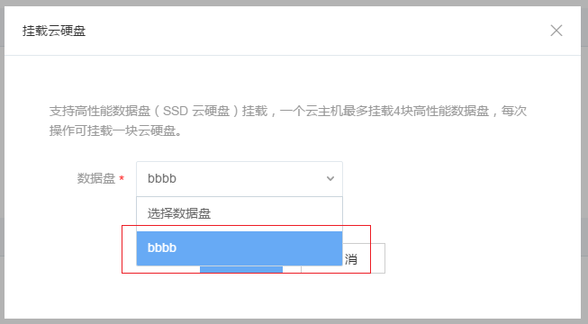

# 挂载云硬盘

在云主机详情页面，点击「挂载云硬盘」，可以为云主机挂载云硬盘。

如果你还没有云硬盘，就需要先创建一个。点击云主机详情页面上的「创建云硬盘」，或者页面左边的「云硬盘」标签，进入云硬盘管理页面，点击「创建云硬盘」，就可以开始创建操作。

填写好名称以及相关信息，适用范围需要选择 「云主机」，然后点击「立即创建」。

成功创建完成后，可以在云硬盘列表里看到它。

如果你已经拥有了可用的云硬盘，可以在云主机详情页面直接点击「挂载云硬盘」，

在下拉列表里选择要挂载的云硬盘，点击「确定」即可将该云硬盘挂载到云主机。

如果绑定成功，在云硬盘管理页面中，可以看到该云硬盘的「挂载状态」变成「已挂载」

对于新创建出来，初次被挂载的云硬盘，执行上面的挂载操作之后，该盘并不是立即可用的，你需要登录进Linux云主机对它进行初始化操作。

关于如何登录云主机请参考：[基本操作](http://support.c.163.com/md.html#!容器服务/云主机/使用指南/linux主机基本操作.md)里的「登录Linux云主机」。

## 初始化云硬盘

Attention:
该操作仅针对新创建的云硬盘，已经被初始化且完成过格式化过的云硬盘，则不需要再格式化，在页面上挂载到云主机后，进入云主机里执行mount命令即可使用。

首先登录进云主机。关于如何登录云主机请参考：[基本操作](http://support.c.163.com/md.html#!容器服务/云主机/使用指南/linux主机基本操作.md)里的「登录Linux云主机」。

以Ubuntu 16.04镜像创建的一台云主机为例：

执行fdisk -l命令，可以看到刚挂载的云硬盘（大小为10G），它的块设备名称为/dev/vdc。

这里以将该盘分成一个区为例，如果要分多个区，请参考fdisk命令的其他用法。

运行 fdisk /dev/vdc，对数据盘进行分区。根据提示，依次输入 n，p，1，两次回车，wq，分区就开始了。

完成后，运行fdisk -l命令，查看新的分区，新分区已经建好了。如下面示例的/dev/vdc1。

运行mkfs.ext3 /dev/vdc1, 对新分区进行格式化，格式化时间取决于数据盘的大小。您也可以选择其他文件格式，如ext4等。

运行 mount /dev/vdc1 /mnt 挂载新分区(如果需要把数据盘单独挂载到某个文件夹，可以修改以上命令中的 /mnt 部分)

执行df -h查看分区。如果出现数据盘信息，说明挂载成功，可以使用新分区了。

Attention:
该mount操作将会在云主机重启之后失效，需要重新执行mount命令进行挂载。如果需要重启之后自动挂载上该云硬盘，请搜索/etc/fstab文件的用法
