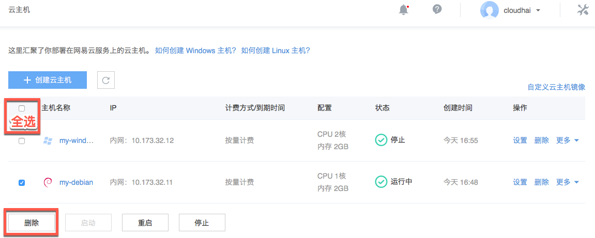

# 删除实例

Note:
仅支持删除按量付费实例，不支持删除包年包月实例；
按量付费实例是按小时计费的，我们建议在整点前释放，例如 16:53 释放的实例比 17:00 释放的实例少收取一小时费用。

## 删除方式一

1. 登录 [控制台](https://c.163.com/dashboard#/m/ingress/)，定位到目标实例；
2. 点击右侧的「**删除**」按钮：

## 删除方式二（支持批量删除）

1. 登录 [控制台](https://c.163.com/dashboard#/m/ingress/)，定位到云主机标签；
2. 勾选待删除的实例后，点击下方的删除按钮：

Note:
选中的实例须都处理可删除状态，删除按钮方可点击。
