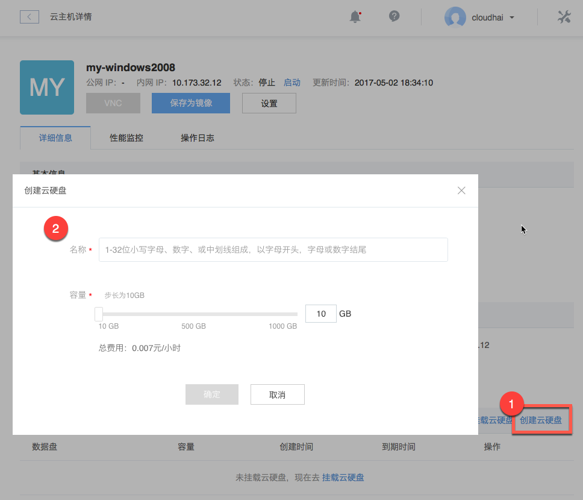

# 创建云硬盘

Attention:
若需要创建包年包月云硬盘或从快照创建云硬盘，请至云硬盘标签下创建，详见 [创建云硬盘](../md.html#!平台服务/云硬盘/使用指南/创建云硬盘.md)

Note:
单个实例最多支持挂载 4 块高性能数据盘（SSD 云硬盘）；
每单云硬盘支持 10-1000 GB 容量，步长 10 GB；

## 操作步骤

1. 登录 [控制台](https://c.163.com/dashboard#/m/win/)，定位到目标云主机实例；
2. 点击实例名称，进入「**云主机详情页**」；
3. 在「**云硬盘信息**」下，点击右侧的「**创建云硬盘**」按钮：

