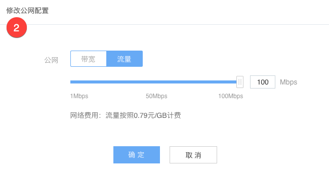

# 修改公网配置

Note:
未绑定公网 IP 的实例，请先 [绑定公网 IP](../md.html#!容器服务/云主机/使用指南/网络/云主机绑定公网IP.md)

## 操作步骤

1. 登录 [控制台](https://c.163.com/dashboard#/m/win/)，定位到目标云主机实例；
2. 点击实例名称，进入「**云主机详情页**」；
3. 在「**配置**」➡ 「**公网配置**」项，点击的「**修改**」按钮：

4. 按需修改配置，点击「**确定**」按钮（请注意费用变化）：
