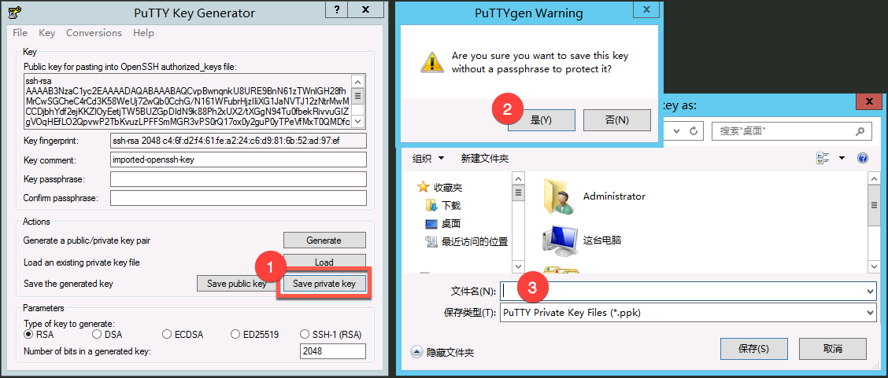
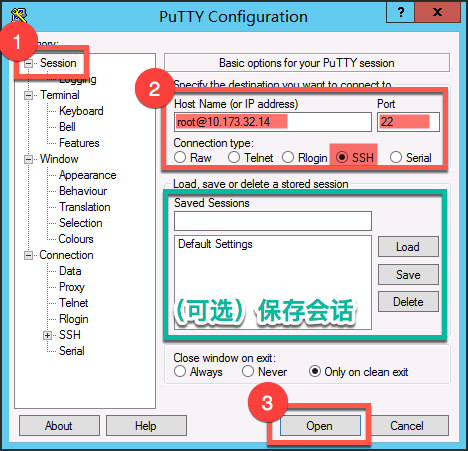
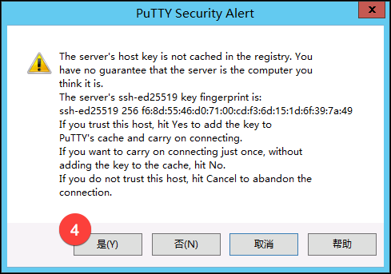

# 连接 Linux 实例

Note:
1.未绑定公网 IP 的实例，可以连接 [蜂巢 OpenVPN](../md.html#!容器服务/服务管理/使用技巧/如何使用蜂巢 OpenVPN.md) 后，使用内网 IP 登录；
2.Linux 云主机默认只允许使用密钥对认证方式的 SSH 登录；
3.SSH 登录的默认用户名为 root，端口为 22；
4.你可以在 SSH 登录云主机后，修改 root 密码，之后可以用此密码使用 VNC 方式登录云主机；
5.我们强烈建议你不要打开云主机的密码认证方式的 SSH 登录，否则你的云主机将极易被攻破；
6.如果你修改了 root 密码，请务必注意密码复杂度，并注意保存好修改后的密码。

## 视频专区

[使用 PuTTY 登录云主机](../main.html#!/play?tag=guide&id=7)
[使用 Xshell 登录云主机](../main.html#!/play?tag=guide&id=1)
[使用 SecureCRT 登录云主机](../main.html#!/play?tag=guide&id=5)

## 本地为 Windows 环境
Windows 环境下可以使用大部分的 SSH 客户端，各 SSH 客户端比较和适用操作系统，请参考 [SSH 客户端比较（Wikipedia）](https://zh.wikipedia.org/wiki/SSH%E5%AE%A2%E6%88%B7%E7%AB%AF%E6%AF%94%E8%BE%83)。
这里以 PuTTY（0.69 版本） 为例，介绍如何在 Windows 环境使用由蜂巢生成的密钥对，通过 PuTTY 客户端连接 Linux 实例（[PuTTY 下载地址](http://www.chiark.greenend.org.uk/~sgtatham/putty/latest.html)）。

### 1.（可选）私钥格式转换
Note:
若使用蜂巢为你生成的密钥对，默认为 .pem 私钥文件，使用 PuTTY 需要先转化为 .ppk 文件。

#### 1.1 启动 PuTTYgen
PuTTYgen 是密钥生成器，在 PuTTY 同一个目录内可以找到。

#### 1.2. 载入私钥文件
1.2.1. 确认「**Parameteers**」➡「**Type of key to generate**」 为 「**RSA**」；
1.2.2. 点击「**Load**」按钮；
1.2.3. 文件扩展名选择「**All Files (\*.\*)**」;
1.2.4. 选择需要转换的私钥文件：

#### 1.3. 转换私钥文件
1.3.1. 点击「**Save private key**」按钮；
1.3.2. 提示没有设置密码的情况下保存密钥，点击「**是(Y)**」；
1.3.3. 自定义文件名称（PuTTYgen 将自动添加 .ppk 扩展名）后保存：

### 2. 登录 Linux 实例

#### 2.1. 启动 PuTTY
#### 2.2. 导入私钥
2.2.1. 左侧类别中选择「**Connection**」➡「**SSH**」➡ 「**Auth**」；
2.2.2. 点击「**Browse**」按钮；
2.2.3. 选择 **1.3.3 步骤** 中生成的密钥：

#### 2.3. 连接
2.3.1. 左侧类别中选择「**Session**」；
2.3.2. 填写会话信息：
   「**Host Name (or IP address)**」填写 `root@实例公网或内网 IP`（[查看实例 IP](../md.html#!容器服务/云主机/使用指南/网络/云主机查看绑定IP.md)）；
   「**Port**」填写 `22`（默认）；
   「** Connection type**」选择 `SSH`（默认）；
2.3.3. 点击底部「**Open**」按钮：

2.3.4. 首次连接提示，点击「**是(Y)**」

## 本地为 Linux 或 Mac OS X 环境

