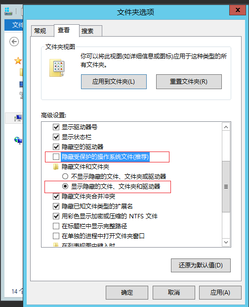
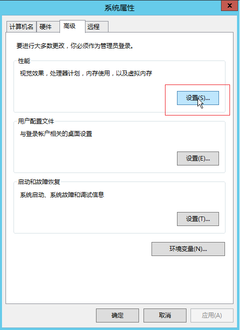

# Windows 常见问题

## 虚拟内存相关

#### Q：如何查看 Windows 系统虚拟内存文件 pagefile.sys？

虚拟内存文件通常是隐藏文件，需要先开启相关配置才能显示。以Windows Server 2012R2镜像创建的一台云主机为例：

首先点击文化夹【查看】中的【选项】

在打开的【文件加选项】中，取消勾选【隐藏受保护的操作系统文件（推荐）】，同时点选【显示隐藏的文件、文件夹和驱动器】

确定之后，即可在系统盘目录下查看到该文件及其大小

#### Q：如何修改Windows云主机虚拟内存的大小?

以Windows Server 2012R2镜像创建的一台云主机为例，右键点击【这台电脑】查看【属性】

在【系统】窗口中，点击【高级系统设置】

在【系统属性】的【高级】面板中，点击【性能】部分的【设置】按钮

点击【虚拟内存】部分的【更改】按钮

在【虚拟内存】的面板中，选择【自定义大小】，填入【初始大小】和【最大值】两个设置值，点击【设置】按钮，可以看到上面的【分页文件大小】已经变成了设定的范围。
点击【确定】后退出。

该改动需要重新启动计算机以使设置生效。

重启计算机后，利用上面的【查看Windows云主机虚拟内存文件】的方法，可以看到虚拟内存文件已经被限制在自定义范围内。

 

