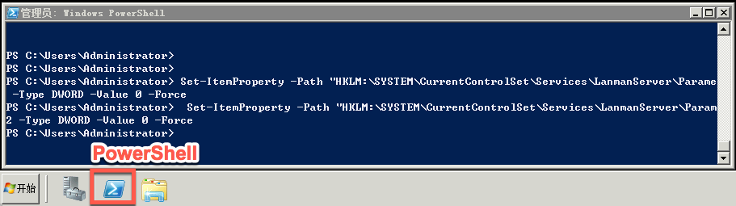

# 如何禁用 SMB

## WindowsServer 2008

Attention:
完成设置后须重启服务器

1. 使用 **远程连接** 或 **VNC** 方式登录云主机，详请参见：[如何登录 Windows 云主机](http://support.c.163.com/md.html#!容器服务/云主机/使用指南/windows主机基本操作.md)；
2. 在 PowerShell 执行以下内容（复制后，右键在 PowerShell 中粘贴）：

		Set-ItemProperty -Path "HKLM:\SYSTEM\CurrentControlSet\Services\LanmanServer\Parameters" SMB1 -Type DWORD -Value 0 -Force
		Set-ItemProperty -Path "HKLM:\SYSTEM\CurrentControlSet\Services\LanmanServer\Parameters" SMB2 -Type DWORD -Value 0 -Force

3. **重启服务器**

## WindowsServer 2012

1. 使用 **远程连接** 或 **VNC** 方式登录云主机，详请参见：[如何登录 Windows 云主机](http://support.c.163.com/md.html#!容器服务/云主机/使用指南/windows主机基本操作.md)；
2. 在 PowerShell 分别执行以下内容（复制后，右键在 PowerShell 中粘贴）：

		Set-SmbServerConfiguration -EnableSMB1Protocol $false -force
		Set-SmbServerConfiguration -EnableSMB2Protocol $false -force

3. 输入以下命令，确认已经禁用了 SMB 协议：

		Get-SmbServerConfiguration | Select EnableSMB1Protocol, EnableSMB2Protocol

