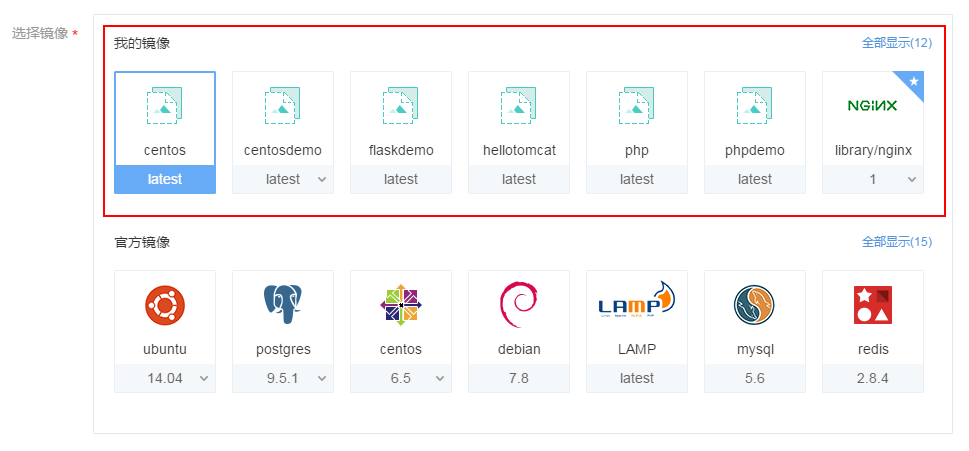
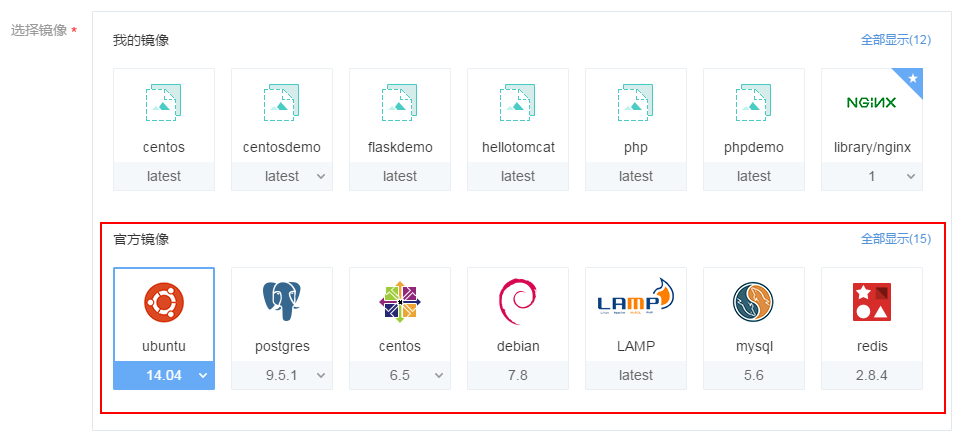
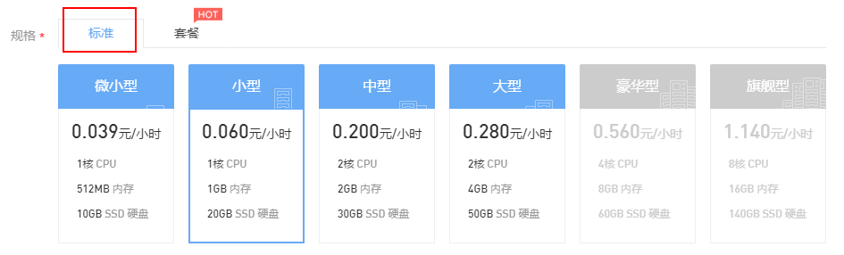
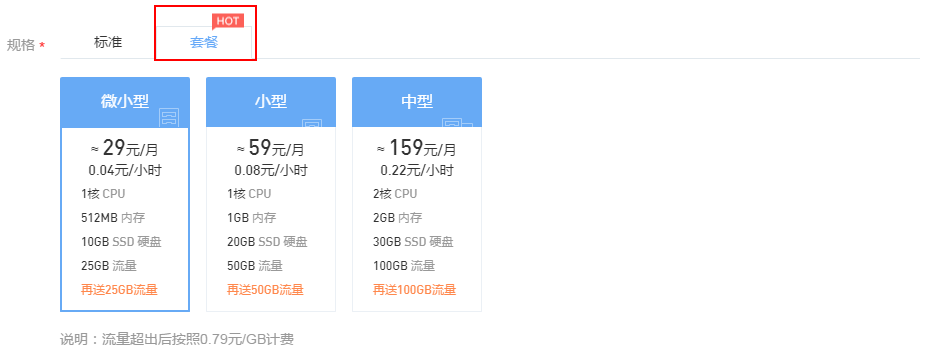
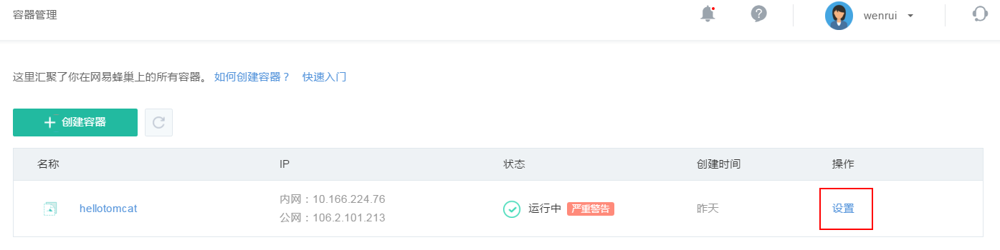

## 创建容器

点击左侧的导航菜单「容器管理」，进入容器管理列表页，通过点击容器列表左上角的「创建容器」按钮可进入创建容器页面，如下图所示：

其中带 * 为必填项。

### 选择镜像
可选择的镜像分为「我的镜像」和「官方镜像」。

**我的镜像**
我的镜像中为用户自定义的镜像以及在蜂巢镜像中心收藏的镜像，如下图所示。其中，收藏的镜像会在镜像右上角用星号标记。注意：默认显示的镜像数量有限，你可以点击右上角「全部显示」查看所有镜像。

**官方镜像**
官方镜像的位置如下图所示：

### 规格
容器的规格分为标准套餐两类。

* 标准规格按需计费，用多少算多少，公网可选择使用或者不使用。使用的情况下又可分为按带宽计费或按流量计费，你可以根据需要灵活配置。你可以选择适合自己的规格套餐。

* 未来蜂巢会陆续提供更多种规格套餐供你选择。按套餐计费创建的容器默认包含公网 IP，并赠送一定的免费流量。如果你需要公网 IP，建议选择按套餐计费。更具体的价格详情，可以参见 服务价格总揽。

### 容器名称
填写容器名称，一般由 3~32 位字母或数字组成，以字母开头。

### 启动命令
填写容器的启动命令，默认执行容器内的启动命令，如遇容器无法启动，可以选择自定义命令。常用自定义命令参考Dockerfile 指令

### 公网
如果需要使用公网 IP，则选择「使用」，计费方式可分为按带宽计费或按流量计费，你可以按需选择。

### SSH 密钥
在创建容器的过程中，可选择 SSH 密钥（即公钥），选择的密钥在创建容器时会注入容器中。创建成功后，即可通过私钥进行 SSH 登录。重要：出于安全考虑，蜂巢不提供采用密码登录的方式，仅支持密钥登录。

倘若使用原生 SSH 客户端登录，需在「创建容器」时，注入 SSH 密钥；否则，可以选择创建密钥。

**注入已有密钥**

* 创建容器时，最多支持注入五个密钥；
* 容器创建成功后，出于安全考虑，不支持在「容器设置」页直接修改密钥；

**创建密钥**

点击「创建密钥」，蜂巢提供两种创建 SSH 密钥方式：

* 创建新密钥：选择「创建新密钥」，蜂巢生成随机密钥，自动下载至本地；
* 导入密钥：选择「导入密钥」，上传本地公钥文件或填写公钥内容导入本地密钥。

更详细的 SSH 密钥操作指南请参见 如何使用 SSH 密钥登录。

### 环境变量
你可在创建容器过程中，将所填环境变量注入到即将生成的容器中，这样可以避免常用环境变量的重复添加。

## 设置容器

创建成功后，可对容器进行设置。在容器列表中点击相应的「设置」按钮,可设置的内容有：容器描述和环境变量。

## 删除容器

容器删除需谨慎操作。如何需要删除不再使用的容器，在容器列表中点击相应容器的「设置」按钮，进入容器设置页面，点击最下方的「删除容器」按钮进行删除即可，如下图所示：

