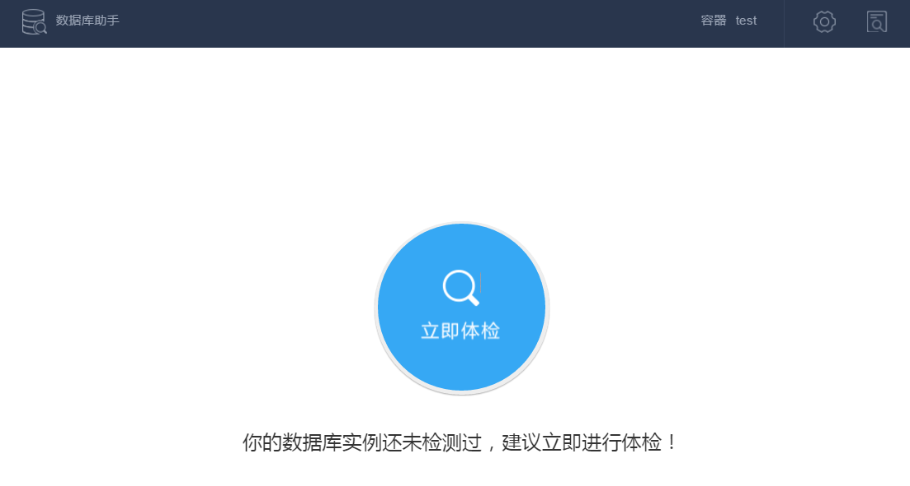
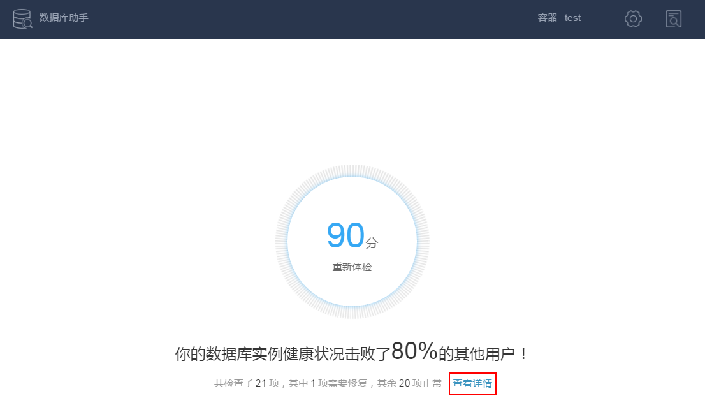
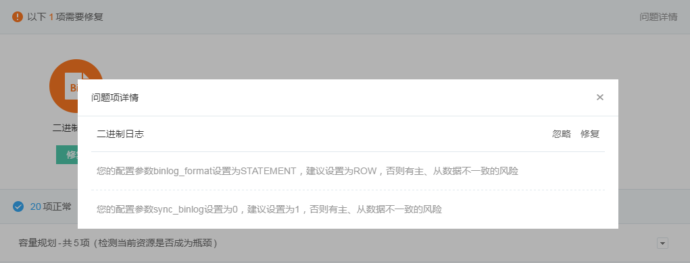
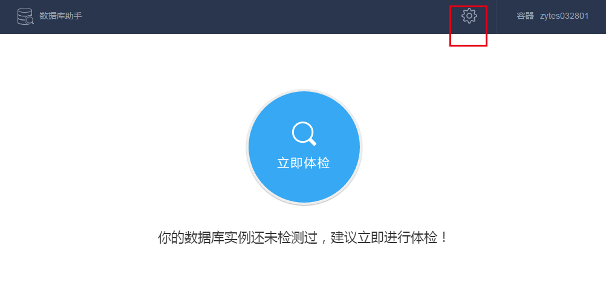

# 容器数据库助手

## 简介

容器数据库助手是蜂巢容器的增值服务，为基于 MySQL 镜像创建的容器提供专业的数据库管理和运维工具。

容器数据库助手的核心模块——数据库健康助手，旨在帮助你提前预知数据库运行风险，给出必要的改进方案和建议，将风险消灭在摇篮中，提升数据库服务质量。通过执行数据库健康检查，可获得直观的健康指数，快速判断当前数据库是否存在风险及其严重程度，并获取对应的修复建议。参考该建议，你可做出必要改进，消除风险，从而提升数据库稳定性。

数据库健康检查诊断内容包括容量规划、安全检查、主从复制、用户访问、参数检查、索引检查六大类， 细分为 21 个检查项。

|**检查类别**|          **检查目的**     |               **检查项**                 |
|------------|---------------------------|------------------------------------------|
|容量规划    |检测当前资源是否成为瓶颈   |弱密码检查、定时体检、网络安全、权限检查  |
|安全检查    |检查服务是否存在安全隐患   |弱密码检查、定时体检、网络安全、权限检查  |
|主从复制    |检查主从复制是否存在隐患   |复制性能、数据安全                        |
|用户访问    |检查用户访问是否正常       |死锁记录、慢日志统计                      |
|参数检查    |检查相关配置参数是否合理   |内存参数、重做日志、二进制日志、连接数配置|
|索引检查    |检测索引设计是否合理       |主键检查、无效索引、冗余索引、索引区分度  |

若数据库健康指数未达到满分 100 分，我们建议：

* 不低于 60 分：数据库存在风险，建议修复；
* 60 分以下：数据库存在严重风险或数据库风险较多，强烈建议 立即修复。
## 健康检查

对于运行中的 MySQL 容器，点击容器列表右侧操作栏的「数据库助手」，进入数据库健康检查。当该容器从未或超过 24 小时未进行健康检查，数据库助手按钮前将出现红点提示。

首次进入「数据库助手」， 系统提示「你的数据库实例还未检测过，建议立即进行体检！」。

点击「立即体检」，开始数据库健康检查。体检过程中，将实时显示当前得分、检查项名称、已检查项和待修复项数量。

体检完成后，系统给出数据库容器的最终得分、待修复项数量等。点击「查看详情」，可查看体检过程中各检查项的详细状态。

## 查看健康检查详情

体检完成后，点击「查看详情」可查看健康检查结果：

* 所有待修复项以橙色图标显示，点击图标可查看该问题的详情和修复建议。
* 点击右侧「查看全部」，可查看所有待修复项问题的详情和修复建议。
例如，点击橙色的「二进制日志」图标，弹出健康助手优化建议，你可以按需点击「忽略」或进行「修复」。

另外，将根据检查类型在页面下方显示检查正常项，可点击右侧按钮展开查看。

**强烈建议**：修复问题后，再次执行健康检查，以确保风险被消除。

## 设置自动健康检查

容器数据库健康助手还拥有自动健康检查功能。

点击右上角的「设置」按钮，勾选「每天自动检测」，设置期望执行健康检查的起止时间，并勾选所需检查的体检项。系统将在设定时间段内的业务空闲时间自动进行健康检查，你可随时登录系统查看检查结果。

**注意**：为保证数据库服务性能，建议选择业务较空闲的时间段进行健康检查。

## 实用工具 - 备份与恢复

进入数据库助手后，页面下方将提供专业的运维工具：

进入「备份与恢复」工具后：

* 「备份」标签页将显示已完成的备份及当前备份/恢复状态及进度，并提供备份的恢复、下载、删除操作；
* 「日志」标签页将提供所有备份、恢复等操作日志；
### 创建备份
进入「备份与恢复」工具后，点击「创建备份」，输入「自定义名称」选择「待备份数据库」后，点击「创建」按钮开始备份：

### 恢复备份
在「备份」标签页选择需要恢复的备份，点击「恢复」按钮，选择「恢复目标」及「待恢复数据库」后，点击「恢复」按钮开始恢复备份：

### 备份设置及自动备份
点击「备份」标签页右上角的「备份设置」按钮，进入备份设置页面：

* 备份参数
  * 备份并发线程数
备份时使用的线程数。通常情况下，线程数越多导出的效率越高。不过需要注意的是，即使这个参数设置了一个很大的数值，实际在导出的时候也不会是无限制的。导出时并发的线程数必定会小于数据库的 Available Connection(max_connections - threads_connected) 并且不会占用全部的 Available Connection。
  * 负载阈值
表示从源实例导出时的负载，在导出时，会检查 Threads_running 数值，如果超过了所设置的阈值，将暂停导出，直到降到阈值以下。这样可以避免数据库读写高峰期时的导出行为影响系统效率。
持锁时间
导出数据时，允许对源实例加读锁（通过执行 flush tables with read lock）的时间长，单位为秒。
* 恢复参数
  * 恢复并发线程数
恢复时使用的线程数。通常情况下，线程数越多，导入的效率越高。不过需要注意的是，即使这个参数设置了一个很大的数值，实际在导入的时候也不会是无限制的。导入时并发的线程数必定会小于数据库的 Available Connection(max_connections - threads_connected) 并且不会占用全部的 Available Connection。
  * 负载阈值
表示从源实例导入时的负载，在导入时，会检查 Threads_running 数值，如果超过了所设置的阈值，将暂停导入，直到降到阈值以下。这样可以避免数据库读写高峰期时的导入行为影响系统效率。
* 自动备份参数
注意：对自动备份参数的修改，不会影响已有的备份。比如修改备份保留时间不会影响已有的备份。
  * 开启/关闭
表示是否需要开启自动备份，默认为「关闭」状态，只有开启自动备份时，下方参数才会生效。
  * 备份周期
表示每两次自动备份的间隔天数。
  * 备份保留时间
自动备份的保留时间，超出保留时间，该备份数据会被自动删除。
  * 备份起始时间
自动备份时间窗口开始的时间。
  * 备份持续时间
自动备份时间窗口大小。自动备份行为发生在自动备份时间窗口内。如果备份创建失败，而且仍然在时间窗内，那么系统会再次尝试自动备份。

