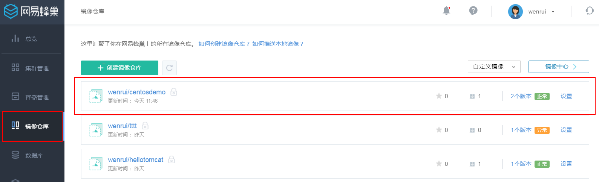

# 常见问题

#### 是否可以再次安装 Docker ？

目前不支持，系统本身就是采用 Docker 运行，直接使用部署即可，无需安装。  

#### 为什么 Reboot 等命令不能运行？

容器本身原生镜像不一定提供这些命令和虚拟机的原生重启、停止等操作，后续会通过界面提供类似功能，敬请期待。

#### 创建容器时选择按套餐计费，为何没有公网 IP 的选项？

套餐中已包含公网 IP ，创建成功后可在容器管理列表中查看公网 IP。  

#### 容器内网 IP 有什么用处？

创建容器时若没有选择使用公网，可以通过内网 IP 以 SSH 方式访问容器，此时需在账户安全中下载 VPN 密钥，通过 OpenVPN 连接，具体操作请参见 如何使用 OpenVPN。  

#### 创建容器时，环境变量选项有什么作用？

用户填入相应的 Key 与 Value，创建容器时会将所填的环境变量注入到容器中。  

#### 容器详情页中的「保存为镜像」按钮有什么功能？

在容器详情页点击「保存为镜像」按钮，在弹出框中输入相应信息提交后即可创建自定义镜像（即快照），如下图所示：

创建的自定义镜像可通过左侧的镜像仓库导航菜单查看。用户下次可直接在自定义镜像列表里面通过保存的镜像创建容器。开发人员可以使用此功能实现容器的数据保存和运行，同时也能实现容器的回退功能。

#### 容器是否可以安装其他软件服务？

可以，基本使用方法和普通的安装软件相同，以 Centos 安装 MySQL 为例。以下是执行更新、安装、查询是否安装成功、启动服务和登录 MySQL 的命令：

    yum update
    yum install -y mysql-server mysql
    rpm -qi mysql-server
    service mysqld start
    mysql

如果开发才有外网的功能，也可以在执行上面的命令后，通过下面的命令给用户赋予权限，就可以直接在本地连接数据：

    GRANT ALL PRIVILEGES ON mydb.* TO 'myuser'@'%' WITH GRANT OPTION;
    GRANT ALL PRIVILEGES ON mydb.* TO 'myuser'@'%' identified by '1';

%表示无限制，任何人都能连接。

#### 推荐的容器套餐规格中额外赠送的流量，是否每月都可以获得？

是的，使用套餐规格每月均可获得额外赠送的流量。详细的套餐资费请参见 蜂巢服务价格总览。
注：流量超出后按照 0.79 元 / GB 计费。