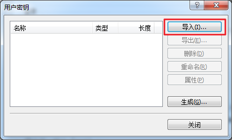
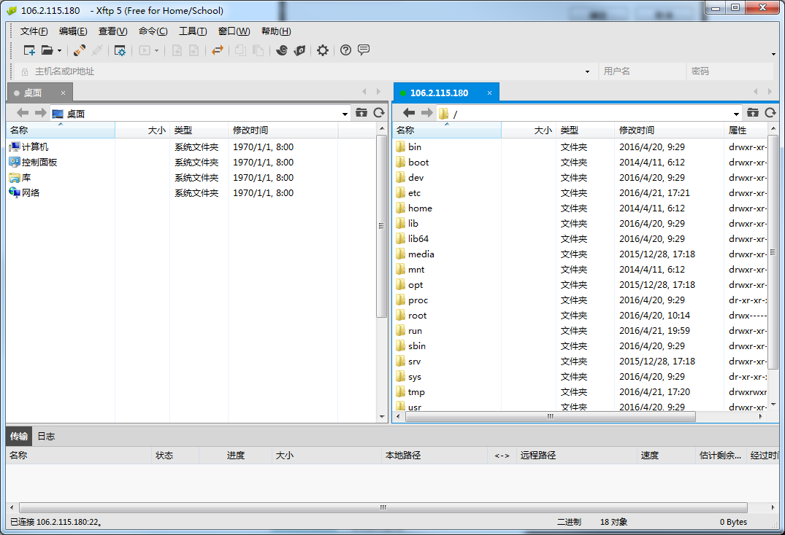

b# 如何上传下载文件

蜂巢支持使用 FlashFXP、Xftp 等多种工具传输文件。这里以 Xftp 5 为例介绍如何在 Windows 和 Linux 间互传文件。

## 准备条件
蜂巢不提供密码登录方式，但支持密钥登录（[为什么要使用密钥](http://support.c.163.com/wiki/md.html#!容器服务/服务管理/使用技巧/如何使用 SSH 密钥登录.md)）。

Attention:
因此创建容器时，需注入密钥（[如何注入密钥](http://support.c.163.com/wiki/md.html#!容器服务/服务管理/使用技巧/如何使用 SSH 密钥登录.md)），以便使用 Xftp 登录。

## 如何使用 Xftp
1、安装并运行 Xftp，点击「文件」-「新建」，在「新建会话属性」窗口输入相关信息：

* 名称：输入自定义名称；
* 主机：输入容器「公网 IP」（未使用公网需 [配置 VPN](http://support.c.163.com/wiki/md.html#!容器服务/服务管理/使用技巧/如何使用蜂巢 OpenVPN.md)，再通过内网 IP 连接）；
* 协议：下拉更改为「SFTP」；
* 端口号：默认「22」；
* 方法：下拉更改为「Public Key」；
* 用户名：输入「root」；

2、 点击「用户密钥」右侧「浏览」按钮，弹出「用户密钥」窗口：

3、点击「导入」按钮，选择并导入 <b>创建该容器时注入的密钥</b>；

4、「用户密钥」下拉菜单选择导入的密钥（请确保该密钥已注入容器），点击「确定」按钮：

5、在「会话」窗口选择需要连接的主机，双击或者点击「连接」按钮：

6、连接成功，开始使用：

Attention:
请勿随意删除文件，系统文件被删除，可能导致异常甚至崩溃。

## 常见问题
**Q：新建会话连接时，报错提示：“所选的用户密钥未在远程主机上注册。请再试一次。”**

A：该情况一般是由于使用了不正确的密钥导致，请确保会话使用的密钥已注入容器。若密钥遗失，可以尝试 [重新注入密钥](http://support.c.163.com/wiki/md.html#!容器服务/服务管理/使用技巧/如何使用 SSH 密钥登录.md)。