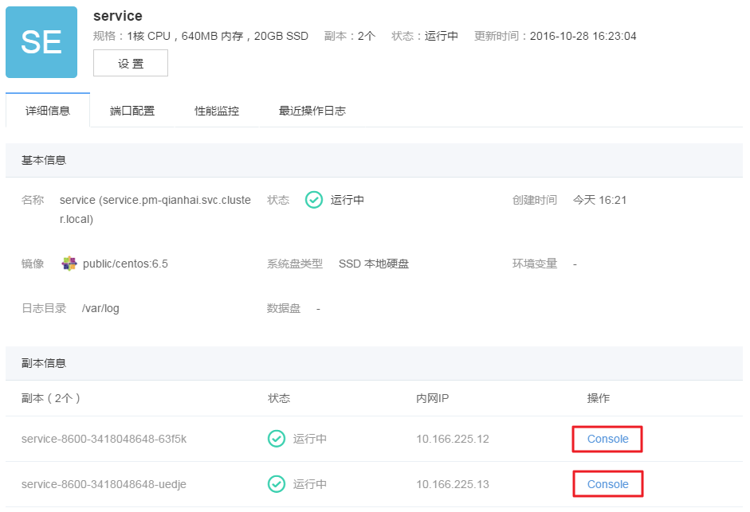
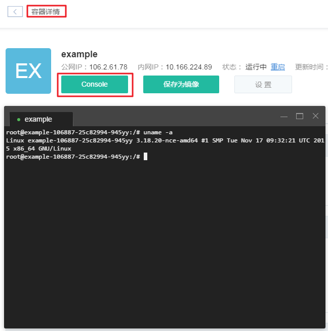
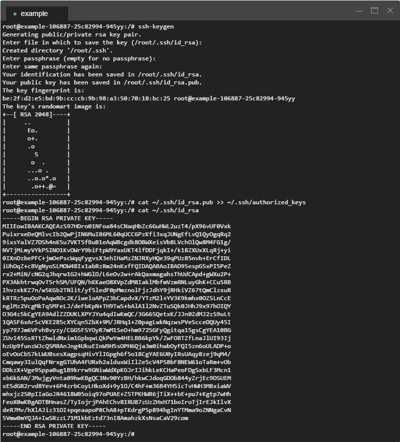

# 如何使用 SSH 密钥登录

## 为什么使用密钥

通常我们使用 SSH 连接并管理远程服务器。默认登录方式为密码认证，看似简单却存在以下问题：

* 无法设置空密码，即使系统允许空密码，亦十分危险；
* 密码容易被偷窥、猜测、窃取、暴力破解等；
* 共享账号时，过多的使用者容易导致密码泄露，修改密码又会影响所有使用者。

**因此蜂巢不提供密码登录方式，但支持密钥登录。**

## 如何注入密钥

若使用原生 SSH 客户端登录，需在创建时，注入 SSH 密钥。

* 注入已有密钥 添加容器时，选择已有 SSH 密钥：
	* 创建容器时，最多支持注入五个密钥；
	* 容器创建成功后，出于安全考虑，不支持在「容器设置」页直接修改密钥。
* 创建密钥 点击「创建密钥」，蜂巢提供两种创建 SSH 密钥方式：

	* 创建新密钥：选择「创建新密钥」，蜂巢生成随机密钥，自动下载至本地；
	* 导入密钥：选择「导入密钥」，上传本地公钥文件或填写公钥内容导入本地密钥。

## 如何使用原生 SSH 客户端

以 Xshell 5 为例，介绍如何使用原生 SSH 客户端。

1、安装并运行 Xshell，点击「文件」-「新建」，在「连接」目录输入相关信息：

* 名称：输入自定义名称；
* 协议：默认「SSH」；
* 主机：输入容器「公网 IP」（未使用公网需 配置 VPN，再通过内网 IP 连接）；
* 端口号：默认「22」；

2、在「连接」-「用户身份验证」目录输入相关信息：

* 方法：下拉选择「Public Key」；
* 用户名：输入「root」；   

3、点击「浏览」按钮，弹出「用户密钥」窗口。点击「导入」，选择并导入本地公钥。后续点击「确定」即可完成连接。

## 如何使用 Web SSH Console

### 服务 SSH 控制台
在服务列表，选择对应服务，进入「服务详情」页，在「副本信息」处找到对应的副本（无状态服务支持多副本），点击右侧的「Console」按钮：

### 容器 SSH 控制台
在容器列表，选择对应容器，进入「容器详情」页，再点击「Console」按钮：

### 集群 SSH 控制台
在集群列表，选择对应集群，进入「集群详情」页，点击对应容器如「1号容器」，再点击「Console」按钮：

## 如何重新注入密钥

若创建容器时「未注入密钥」或「本地私钥丢失」，可以通过 Web SSH Console 重新注入密钥：

1.  打开对应容器 Console，输入以下命令生成新密钥对：<pre>ssh-keygen</pre>
2.  生成过程，默认全部回车即可，生成完毕输入以下命令将公钥导入授权文件：<pre>cat ~/.ssh/id_rsa.pub >> ~/.ssh/authorized_keys</pre>
3.  再输入以下命令输出「私钥」，将输出内容复制（**复制后注意删除多余空格**）或下载到本地，保存为任意文件名。<pre>cat ~/.ssh/id_rsa</pre>

4.  在原生 SHH 客户端导入该私钥即可。