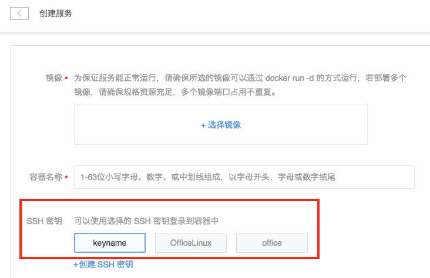

# 如何注入 SSH 密钥

目前我们提供两种方式管理容器内的密钥：

* 蜂巢托管（所有密钥操作在控制台进行）
* 自主管理（所有密钥操作在命令行进行）

若在控制台进行密钥操作（如创建容器时注入密钥，创建完成后重新注入密钥），则将不再支持自主管理，该过程不可逆。

## 一、蜂巢托管

Attention:
如果使用场景中有使用蜂巢容器 SSH 其他服务的情况，请务必不要在控制台操作密钥。

### 1. 创建时注入密钥

在创建有状态的过程中，可选择 SSH 密钥（即公钥），选择的密钥在创建服务时会注入容器中。创建成功后，即可通过私钥进行 SSH 登录。无状态服务本身不建议在容器内部做改动，所以无状态服务不支持在控制台注入密钥。

* 注入已有密钥：创建有状态服务时，选择已有 SSH 密钥：
	* 创建服务时，最多支持注入五个密钥；
* 创建密钥：点击「创建 SSH 密钥」，蜂巢提供两种创建 SSH 密钥方式：

	* 创建新密钥：选择「创建新密钥」，蜂巢生成随机密钥，自动下载至本地；
	* 导入密钥：选择「导入密钥」，上传本地公钥文件或填写公钥内容导入本地密钥。

### 2. 创建完成后重新注入密钥

2.1. 在服务列表，选择需要重新注入密钥的有状态服务；
2.2. 在服务的设置页面，支持重新注入密钥，操作同创建密钥。

## 二、自主管理

### 1. 重新生成密钥

Note:
若没有密钥，可以使用以下方法在容器内生成新的密钥对，然后将私钥拷贝到本地使用。

1.1. 打开 Web Console（[如何使用蜂巢 WebConsole](http://support.c.163.com/md.html#!容器服务/服务管理/使用技巧/如何使用蜂巢WebConsole.md)），输入以下命令生成新密钥对：

	ssh-keygen

1.2. 生成过程中的人工交互部分，默认全部回车即可，生成完毕输入以下命令将公钥导入授权文件：
	
	cat ~/.ssh/id_rsa.pub >> ~/.ssh/authorized_keys

1.3. 输入以下命令输出「私钥内容」，并将输出内容复制或下载到本地，保存为任意文件名。

Attention:
复制后注意删除多余空格和换行符。

	cat ~/.ssh/id_rsa

1.4. 在原生 SSH 客户端导入该私钥即可使用，详见：[如何使用 SSH 密钥登录](http://support.c.163.com/md.html#!容器服务/服务管理/使用技巧/如何使用 SSH 密钥登录.md)。

## 2. 添加公钥

Note:
若本地已有可用密钥对，可以使用以下方法，将公钥添加至容器中。

2.1. 打开 Web Console（[如何使用蜂巢 WebConsole](http://support.c.163.com/md.html#!容器服务/服务管理/使用技巧/如何使用蜂巢WebConsole.md)），输入以下命令创建 .ssh 文件夹并调整权限：

	mdkir ~/.ssh
	chmod 700 ~/.ssh

2.2. 输入以下命令将本地公钥内容（.pub 文件）导入授权文件：

	echo "此处填写你的公钥内容" >> ~/.ssh/authorized_keys

2.3. 调整权限：

	chmod 600 ~/.ssh/authorized_keys

2.4. 在原生 SSH 客户端导入本地私钥即可使用，详见：[如何使用 SSH 密钥登录](http://support.c.163.com/md.html#!容器服务/服务管理/使用技巧/如何使用 SSH 密钥登录.md)。

