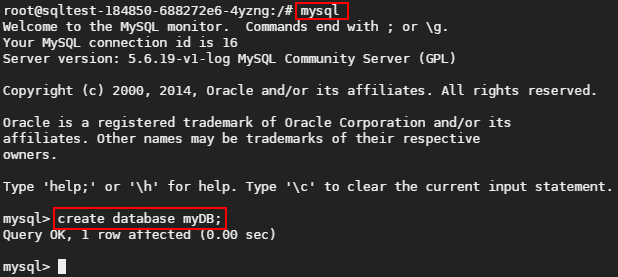
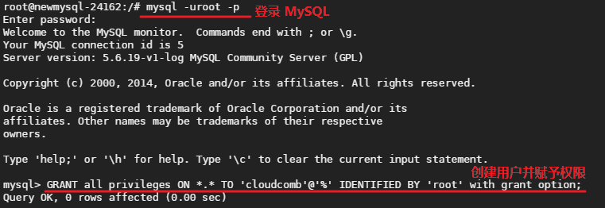

# 如何迁移数据库

安装 MySQL 时自带的 mysqldump 可用来将数据转移到另一个 MySQL 服务器。本文简单介绍了如何使用 mysqldump 迁移数据库。

Note:
蜂巢数据库（RDS）用户可以直接使用我们提供的[数据库迁移工具](http://support.c.163.com/md.html#!平台服务/数据库/使用指南/迁移外部数据库.md)

## Windows 环境迁移到容器

注：本例中使用的所有账号均为 root 权限，新的数据库也开启了公网访问。

### 第一步：在新的数据库中创建同名数据库

如下图所示，本示例中导入的数据库名为「myDB」，则在新的数据库中创建名称同为「myDB」的数据库：

### 第二步：添加环境变量

Attention:
以下操作均在老的数据库主机上进行。

将本地数据库导入蜂巢数据库前，需要安装 MySQL 数据库。安装完成后，mysqldump.exe 存在于安装目录下的 bin 文件夹中。此时需要 bin 文件夹的路径添加到系统变量的 Path 中，例如：`C:\Program Files\MySQL\MySQL Server 5.5\bin·，之后 mysqldump 命令即可使用。

Note:
不添加环境变量的情况下，也可以直接命令行到 mysqldump 所在目录执行。

### 第三步：导出数据库文件

使用 CMD 命令行将数据库以文件形式保存在本地，具体操作如下：

	mysqldump -u[本地安装数据库服务时设置的数据库账户名称] -p[数据库账户密码] [数据库名称] > [保存文件的路径+文件名称]

若无错误提示，则可以在你输入的路径下找到该数据库文件（上例中是 `e:/myDB.sql`）。

### 第四步：导入数据
输入以下命令将本地的数据库文件导入到新的数据库：

	mysql --default-character-set=utf8 -h[新的数据库实例的公网IP] -P[端口] -u[数据库账户名称] -p[数据库账户密码] [数据库名称] < [存放在本地的数据库文件路径+文件名称]

若无错误提示则表示导入成功。

## Linux 环境迁移到容器

### 第一步：在新的数据库中创建迁移账号

我们建议新建一个拥有相应权限的账号进行数据迁移。 登录 MySQL 客户端，使用如下命令创建账号并赋予权限：

	GRANT all privileges ON [数据库名].[表名] TO '[期望创建的用户名]'@'[用户地址]' IDENTIFIED BY '[期望设置的密码]' with grant option;

Note:
方便起见，本例中直接赋予数据库所有表的全部权限：GRANT all privileges ON *.*
[用户地址] 可以是 IP 地址、计算机名、域名，如果想从任意地址连接，使用「%」即可；
重要：该帐号拥有所有权限，出于安全考虑，数据迁移完成后，请删除该账号或直接删除本地数据库；

### 第二步：在新的数据库中创建同名数据库

如下图所示，本示例中导入的数据库名为「myDB」，则在新的数据库中创建名称同为「myDB」的数据库：

### 第三步：导出数据库文件

Attention:
以下操作均在老的数据库主机或容器上进行。

使用 mysqldump 命令行将数据库以文件形式保存在本地，具体操作如下：

	mysqldump -u[本地安装数据库服务时设置的数据库账户名称] -p[数据库账户密码] [数据库名称] > [保存文件的路径+文件名称]

若无错误提示，则可以在你输入的路径下找到该数据库文件（上例中是 `home/myDB.sql`）。

### 第四步：导入数据

输入以下命令将本地的数据库文件导入到新的数据库：

	mysql --default-character-set=utf8 -h[新的数据库实例的公网IP] -P[端口] -u[数据库账户名称] -p[数据库账户密码] [数据库名称] < [存放在本地的数据库文件路径+文件名称]

若无错误提示则表示导入成功。示例中的 Warning 是 MySQL 5.6 为了确保数据库安全性采用的机制，不影响结果。
