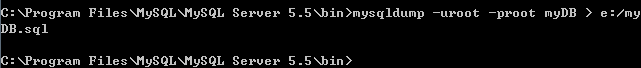

# 如何迁移数据库

安装 MySQL 时自带的 mysqldump 可用来将数据转移到另一个 MySQL 服务器。本文简单介绍了如何使用 mysqldump 迁移数据库。

Note:
蜂巢数据库（RDS）用户可以直接使用我们提供的[数据库迁移功能](http://support.c.163.com/md.html#!平台服务/数据库/使用指南/迁移外部数据库.md)

## Windows 环境迁移到容器

**１、导出数据库文件**
使用 CMD 命令行将数据库以文件形式保存在本地，具体操作如下：
`mysqldump -u[本地安装数据库服务时设置的数据库账户名称] -p[数据库账户密码] [数据库名称] > [保存文件的路径+文件名称]`

若无错误提示，则可以在你输入的路径下找到该数据库文件（上例中是 `e:/myDB.sql`）。