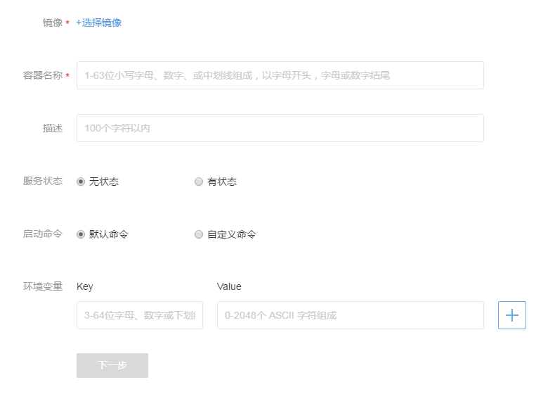

# 创建无状态服务

## 创建空间

点击左侧的导航菜单「服务管理」，进入服务管理页面，通过点击左侧空间列表左上角的「创建空间」按钮即可创建空间。

「空间」对应 Kubernetes 的 [Namespace](http://kubernetes.io/docs/user-guide/namespaces/)，使用空间可以将服务资源进行逻辑隔离，划分成不同的虚拟集群。例如，用户如果需要创建测试、联调、线上环境，可以通过空间来对这些环境进行隔离。

## 创建服务

点击服务列表左上角的「创建服务」按钮可进入创建服务页面。

* 「服务」对应 Kubernetes 的 [Service](http://kubernetes.io/docs/user-guide/services/)，用户通过<服务名称>:<服务端口>可以访问部署的服务 ，使用服务可以实现对应用的弹性伸缩、负载均衡、灰度升级、错误恢复。
* 「副本」对应 Kubernetes 的 [Pods](http://kubernetes.io/docs/user-guide/pods/)，是最小的部署单元和计费单位。一个副本根据应用场景，可以由一个或多个容器组成。当一个副本中有多个容器时，这些容器将会共享副本的计算资源、存储空间、IP和端口，对于计算资源还可以限制各个容器使用的比例。 对于无状态服务，副本随时可以删除和创建，当一个副本发生异常时，系统会删除该副本，然后再创建一个新的副本，从而维持了服务的副本数不变，实现错误弹性恢复，不影响服务的可用性。对于多个容器紧耦合的应用场景，比如主业务+数据采集的场景，可以使用单副本多容器的部署方案。

**服务分为有状态和无状态两种类型：**

* 有状态服务可以挂载数据盘，实现数据持久化，有状态服务仅可以拥有一个副本；
* 无状态服务则可以有多个副本，配合负载均衡使用，保证服务的可用性。

## 创建无状态服务

### 添加容器

#### 选择镜像
可选择的镜像分为「我的镜像」、「蜂巢官方镜像」和「Docker Hub 镜像」。

「我的镜像」中包含用户自定义的镜像以及在蜂巢镜像中心收藏的镜像，**请注意在此选择您所需要的镜像版本**。其中，收藏的镜像左上角以星号标记。

#### 容器名称
填写容器名称，由 1~63 位小写字母、数字或中划线组成，以字母开头，字母或数字结尾。

#### 服务状态
选择「无状态」

#### 启动命令（高级设置内）

自定义启动命令后会覆盖 Dockerfile/镜像 内的 CMD 命令，如遇到未正确设置容器启动命令而导致服务创建失败，可以设置自定义命令。

Attention:
若不了解原 Dockerfile/镜像的 CMD 和 ENTRYPOINT 内容，我们不建议修改自定义启动命令。

注意：

* 此处填写内容仅需输入 CMD 括号内内容，如命令 `CMD ["/usr/sbin/sshd","-D"]` 仅需填写 `/usr/sbin/sshd -D`
* 添加自定义命令前，建议先了解 [CMD](https://docs.docker.com/engine/reference/builder/#cmd) 和 [ENTRYPOINT](https://docs.docker.com/engine/reference/builder/#entrypoint) 命令；
* 自定义命令不支持覆盖 ENTRYPOINT，鉴于此点如需添加自定义命令须了解原镜像的 CMD 和 ENTRYPOINT 内容；
* 请正确填写自定义命令，错误的自定义命令将导致服务创建失败。关于自定义命令请参考 [如何自定义服务启动命令](http://support.c.163.com/wiki/md.html#!容器服务/服务管理/使用指南/如何自定义服务启动命令.md)。

#### 环境变量（高级设置内）
你可在创建服务过程中，将所填环境变量注入到即将生成的容器中，这样可以避免常用环境变量的重复添加。

#### 日志目录（高级设置内） 

日志服务将会自动采集该目录中的日志，在日志服务中可进行日志搜索和分析。日志目录需要定义为一个文件目录（以“/”开头且以“/”结尾），并且请确认不要设置为系统路径。

### 配置运行环境
点击下一步，进入配置运行环境界面，如下图所示：

#### 服务名称
填写服务名称，由 1~63 位小写字母、数字或中划线组成，以字母开头，字母或数字结尾。

#### 规格
你可以选择合适自己项目的规格。

#### 端口配置
端口配置定义了容器和服务的端口映射关系，在容器端口填写进程监听的端口，在服务端口填写服务对外提供的端口。详见 [如何进行端口配置](http://support.c.163.com/wiki/md.html#!容器服务/服务管理/使用指南/如何进行端口配置.md)。

#### 副本数
无状态服务支持多副本，副本配置定义了你的服务后端容器副本的个数，支持在线扩缩容。

### 开始创建
配置完成后，点击「立即创建」按钮，调换至服务的「最近操作日志」页面，在此你可以查看构建的日志信息。

若遇到创建日志提示启动容器失败，请检查容器配置是否正确。请参考 [启动容器失败 FAQ](http://support.c.163.com/md.html#!容器服务/服务管理/常见问题/启动容器失败 FAQ.md)。