# 如何进行持续集成

Attention:
着重注意文档中 Attention 部分，否则可能出现搭建失败的情况

## 一、持续集成概念
持续集成能够帮助开发者快速适应不断变化的需求和保证软件的质量。
使用容器技术，持续集成变得更简单。
本文将以 github 为例介绍如何在蜂巢中使用 jenkins 快速搭建自己的测试持续集成环境。

## 二、使用场景
当发生 push 操作时，能够触发测试环境的持续集成。

## 三、步骤

### 1.搭建 master 节点
蜂巢在官方 jenkins 镜像的基础上预先安装了 jenkins 的插件并预置了用户 (jenkins/jenkins)，jenkins节点分为 master 节点和 slave 节点，Master/Slave 相当于 Server 和 Agent 的概念，Master 节点提供 web 接口来让用户管理 job 和 slave，job 可以运行在 master 本机也可以被分配到 slave 上运行。一个 master 可以关联多个 slave 来为不同的 job 或相同的 job 的的不同配置来服务。即 master 作为管理角色，slave 执行构建工作。

#### 1.1.创建空间

为区别于其他服务建议在蜂巢中新建一个空间，如 ci，如图:

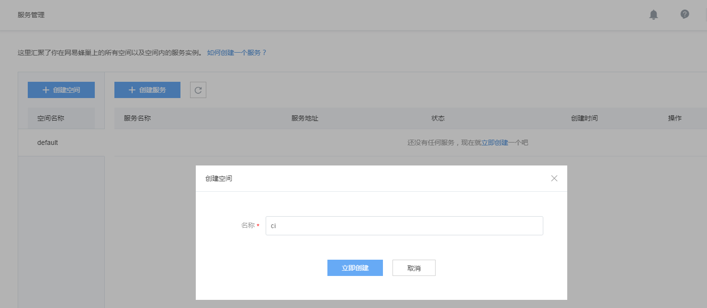

#### 1.2.创建 master 服务

在空间 ci 下创建 jenkins master 服务。推荐使用有状态服务，使用有状态服务的优点如下:
* 有状态服务有外网 IP，外网 IP 可以用于 github 添加 webhook，
* 有状态服务可以挂载云硬盘，挂载云硬盘可以保证 jenkins 的配置数据不丢失。

创建服务，服务名称为 master，服务状态选择有状态，如图:

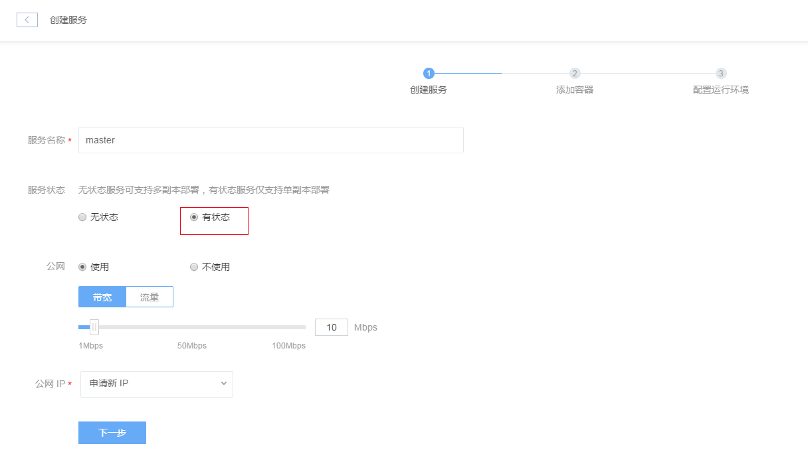

点击「下一步」，选择镜像public/jenkins:2.19.2，如图:

填写容器名称，如"master"。
SSH 密钥部分不用操作，不建议新建密钥，不建议选择已经有的密钥，后期需要使用密钥时可在后期进行手动注入，具体可参考[如何注入密钥](http://support.c.163.com/md.html#!容器服务/服务管理/使用技巧/如何注入SSH密钥.md)

挂载数据盘部分选择新建云硬盘，可以命名为 master，如图:

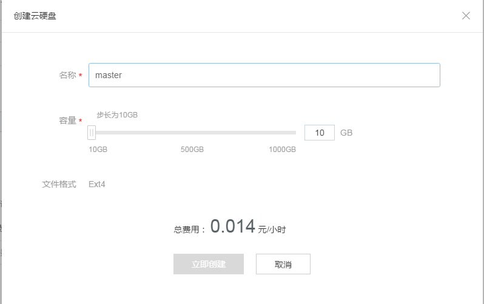

挂载目录填写/var/jenkins_home/，挂载到这个路径的原因是 jenkins 的配置信息在路径/var/jenkins_home/下，这样 jenkins 的配置数据便存储在了云硬盘中，后期需要重新建 master 节点时直接将之前的云硬盘挂载到路径/var/jenkins_home/即可，节省 jenkins 的配置操作。如图:

启动命令选择默认命令。
环境变量和日志目录可以根据自己需要进行填写。
点击下一步，如图：

根据自己需要配置计费方式、规格、端口配置，确认配置信息后点击立即创建即可开始 master 服务的创建。

Attention:
如果使用的是自己私网搭建的 github，需要确保搭建的 github 和 jenkins master 之间的网络连通。
如果是自己制作的镜像，建议不要将 Dockerfile 中配置的卷的挂载路径和云硬盘的挂载路径重合。

### 2.修改jenkins默认密码

用户 jenkins 为管理员，默认拥有全部权限，默认的用户名和密码皆为 jenkins，建议用户新建完 master 节点后修改默认的密码。
登录 jenkins，访问地址为 "master 公网 ip:8080"，如图:

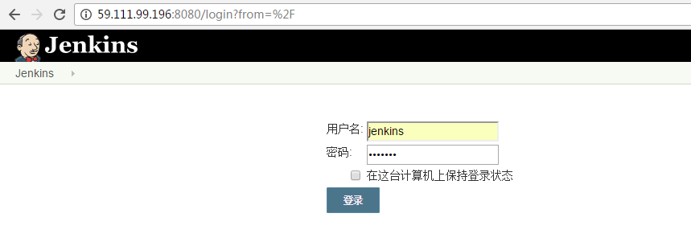

填写默认的用户名和密码，登录，点击系统管理，如图:

点击「管理用户」，如图:

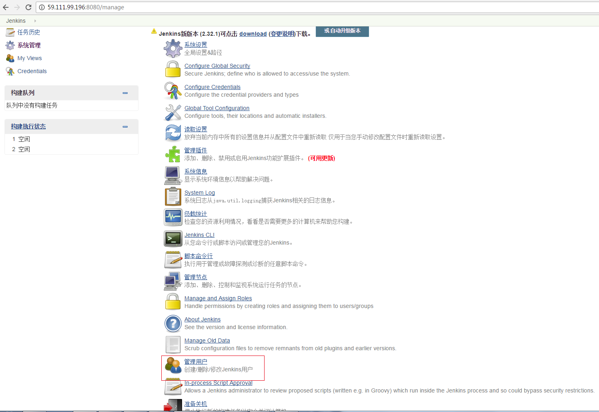

点击设置图标进入用户信息配置页面，如图:

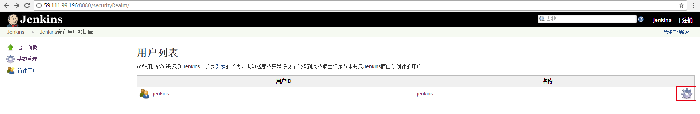

进入用户信息配置页面后在「密码」部分进行密码的修改，如图:

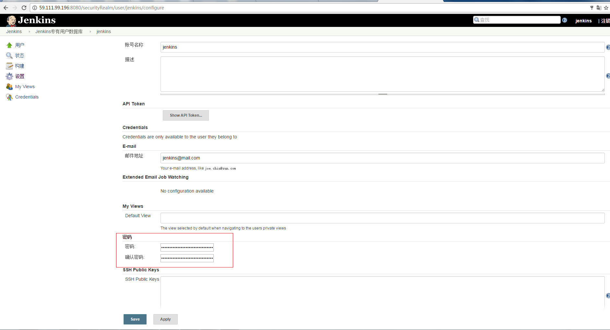

### 3.创建用于 webhook 的用户

鉴于用户 jenkins 为管理员权限，推荐新建一个专门用于 webhook 回调的用户，如 ciwebhook。
点击 jenkins 首页面中「系统管理」，进入系统管理页面后点击「管理用户」，点击「新建用户」，填写用户信息，如图:

点击「系统管理」，在系统管理页面点击「Manage and Assign Roles」，如图:

点击「Manage Roles」，如图:

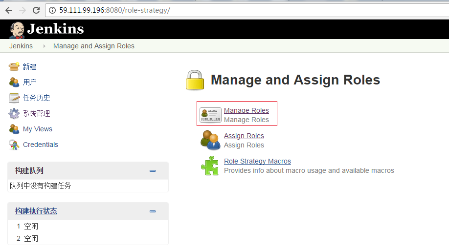

增加 ciwebhook 角色，并赋予 overall read 权限，如图:

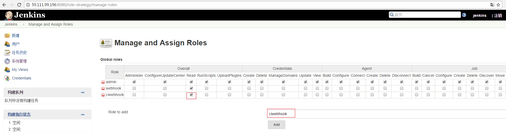

点击「apply」和「save」之后点击「Assign Roles」，如图:

进入 Assign Roles 界面，为用户赋予 ciwebhook 角色，如图:

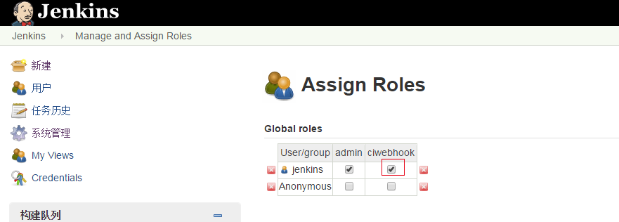

点击「Apply」和「Save」

### 4.jenkins中新建子节点

在 jenkins 首页面点击「系统管理」后点击「管理节点」，如图:

进入管理节点之后点击「新建节点」，填写节点名称，如slave，如图:

点击「OK」进入子节点配置页面，如图:

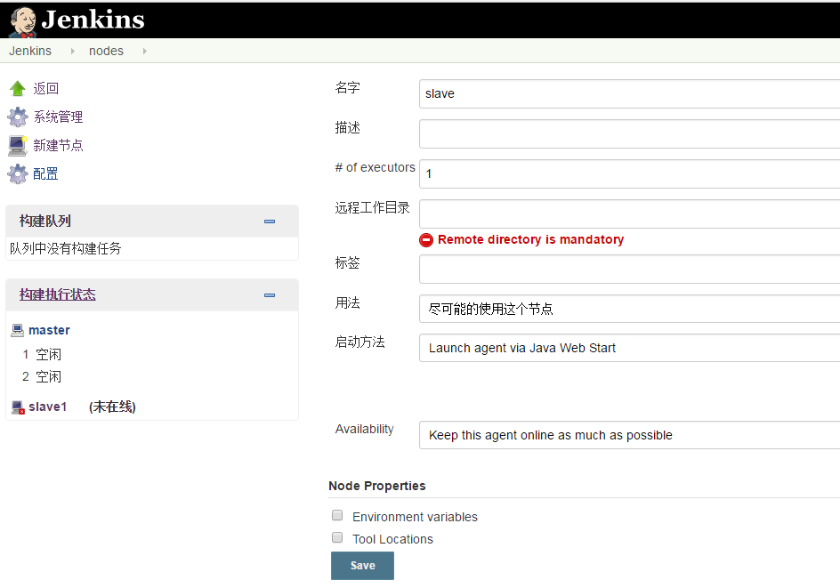

Note:
此页面无需进行配置

点击「save」，如图:

点击新建的节点，如图:

记录变量jnlpUrl 的数值 "http://59.111.96.140:8080/computer/slave/slave-agent.jnlp"

### 5.创建 slave 服务

在空间 ci 中新建服务 slave，如图:

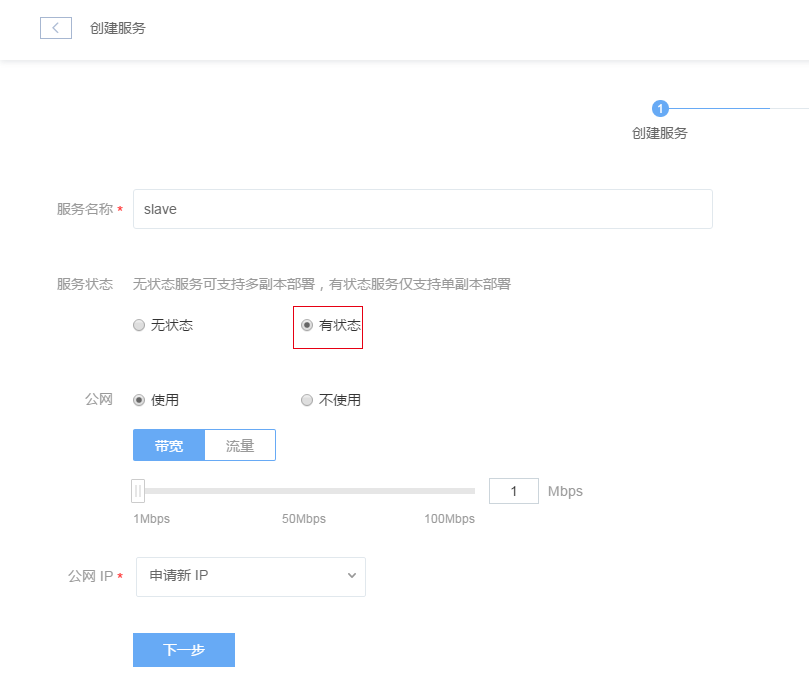

点击「下一步」,在官方镜像中选择镜像"public/jenkins-python-slave:1.0"，如图:

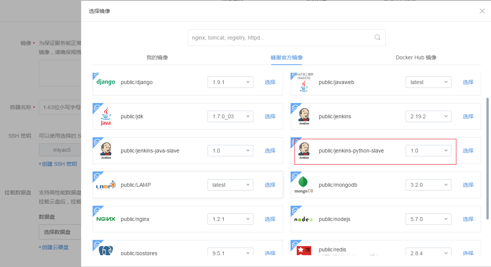

目前蜂巢官方jenkins slave镜像提供python类型和java类型，本示例使用python类型，容器名称slave，如果新建的是有状态服务此处不建议创建密钥或者选择已经存在的密钥，创建云硬盘部分可以选择新建云硬盘并填写要挂载的目录。
点击「高级设置」，此处需要添加两个环境变量，JNLP_CRENDIENTIALS  jenkins:jenkins 和 JNLP_URL http://59.111.96.140:8080/computer/slave/slave-agent.jnlp ，ciwebhook:ciwebhook指的是用于jenkins连接的用户名和密码，由于jenkins是管理员权限，考虑到安全性此处建议使用专门用于jenkins连接的用户，此处使用的是新建的用户ciwebhook，JNLP_URL的值为新建子节点时记录的jnlpUrl的值，如图:

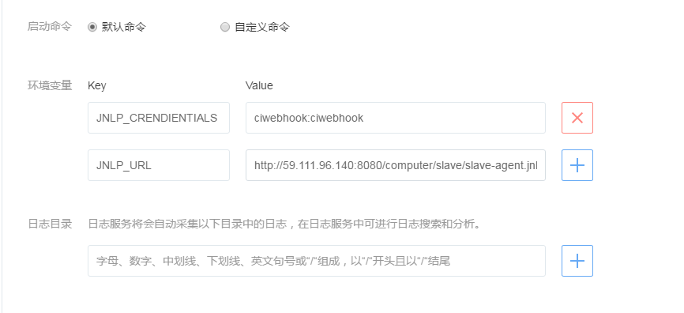

Attention:
环境变量JNLP_URL中slave指的是从节点的名称，必须和从节点名称一致

点击「下一步」，根据需要选择计费方式、规格，容器端口和服务端口配置为50000，如图:

点击「立即创建」开始 slave 服务的创建。

Attention:
环境变量 JNLP_CRENDIENTIALS 和 JNLP_URL 必须注入，否则 slave 服务会失败。
环境变量的 key 和 value 两侧可能会存在空格，需要删除空格。

### 6.配置slave节点

进入节点管理页面，配置节点slave，如图:

填写远程「工作目录」，如"/home/jenkins/workspace/"，选择「用法」,如"只允许运行绑定到这台机器的job"，选择「启动方法」，如"launch agent with java webstart"，其他选项默认即可，如图:

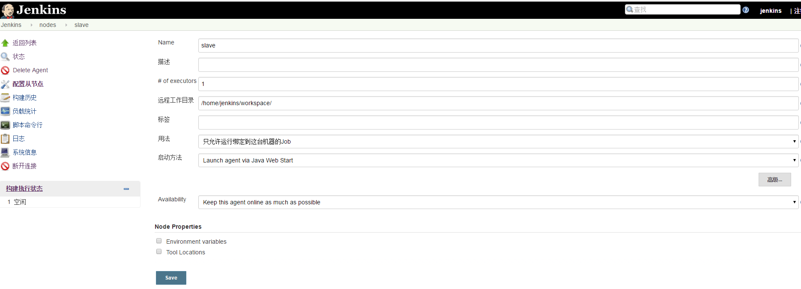

点击「save」此时子节点变为可用状态，如图:

### 7.新建任务

在 jenkins 首页面点击「新建」，填写任务名字，如 python-ci，任务类型选择"Pipeline"，如图:

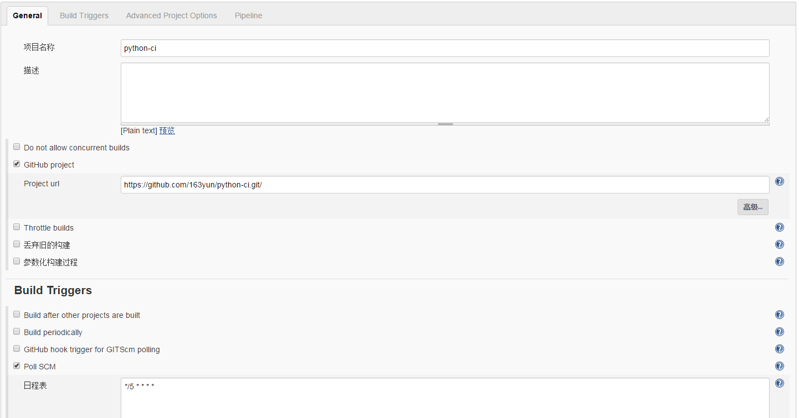

点击「OK」，进入任务配置页面，如图:

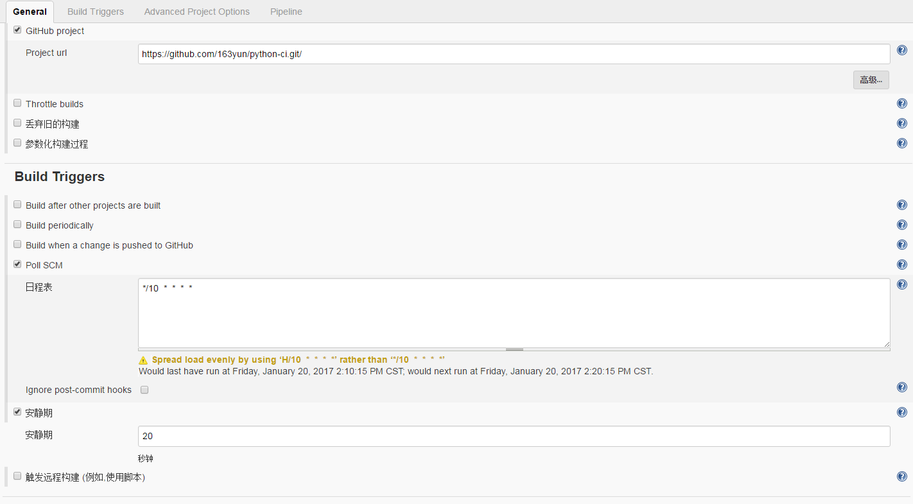

项目名称 python-ci，选择"GitHub project"，填写Project url。
选择Build Triggers， 如"Poll SCM"，即周期性检查是否有 push 操作，如有则触发构建，日程表中填写检查周期，本例中为 5 分钟检查一次，安静期设置为 20 秒。
Pipeline 部分中 Difinition 选择"Pipeline script from SCM"，SCM 选择"Git"，	Repository URL 填写项目的地址，如https://github.com/929121806/test1.git，Script Path 填写 Jenkinsfile 文件的路径。
点击「Apply」「保存」此时任务新建完成。

Attention:
建议设置安静期，否则当多个 slave pull 代码时可能会发生冲突

### 8.镜像仓库配置

#### 8.1.新建镜像仓库

新建镜像仓库，填写仓库名，持续集成选择"支持"，访问权限选择"私有"，此处必须选择为私有，如图：

点击"立即创建"。

镜像仓库新建完成后进入构建镜像页面，选择"代码构建"，源码管理部分需要进行 github账号的认证，选择项目名称和分支，构建触发条件选择"提交代码到分支"，这样当提交代码到指定的分支后会自动触发 Jenkins 构建，Dockerfile 中填写 Dockerfile 文件在 github 工程中的路径。
点击「立即创建」完成构建镜像的配置。具体过程可参考[创建自定义镜像](http://support.c.163.com/md.html#!容器服务/镜像仓库/使用指南/创建自定义镜像.md)

### 9.测试
修改工程信息，向 github 进行 push 操作，此时会触发在 slave 节点上的自动构建，如图:

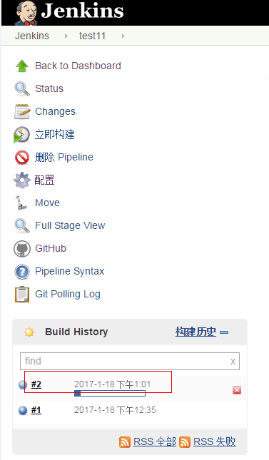

各个阶段的进度如图:

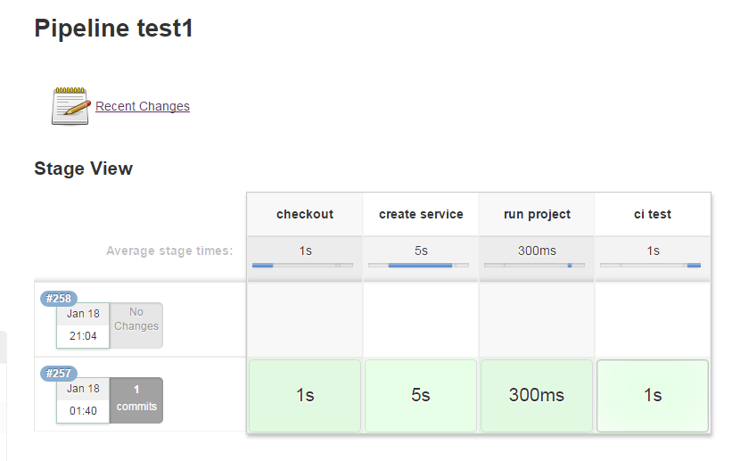

从 console output 可以查看构建过程输出的日志，如图:

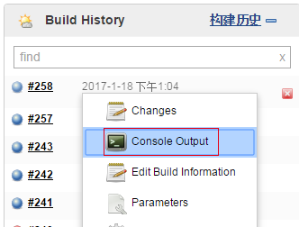

### 10.示例项目解释

github 中包含一个简单的示例项目 python-ci，包含文件 Dockerfile、Jenkinsfile、main.py、test.py、service.sh。
代码可从[示例项目地址](https://github.com/163yun/python-ci.git)获取。

* Jenkinsfile文件中记录构建的每个操作，push操作发生后会触发镜像仓库中新镜像的构建，同时也会触发持续集成的过程，接着会自动执行Jenkinsfile中的内容，github中项目文件会被拉取到slave节点上的/home/jenkins/workspace/中，接着执行文件service.sh。

* service.sh 进行服务的创建，由于镜像构建相对较慢，在镜像构建未失败的情况下需要等到镜像构建完成才可创建服务，镜像构建失败时构建日志中会给出报错提醒。服务新建成功后输出服务的 id，否则会报错。具体执行过程可以结合代码和代码注释进行了解。蜂巢提供了更多的api帮助用户实现持续集成，具体可参考:[api文档](http://59.111.120.124/)

* main.py 为示例项目程序，程序中执行一个文件a.log的新建操作。

* test.py 为示例项目测试程序，通过判断文件a.log是否生成在构建日志中输出对应的测试信息。

构建操作日志如图:

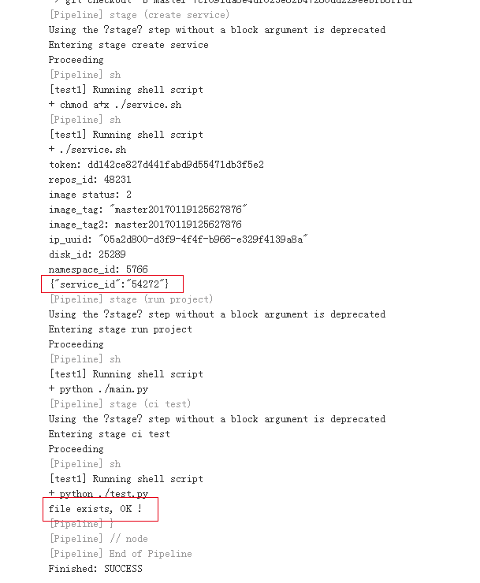

