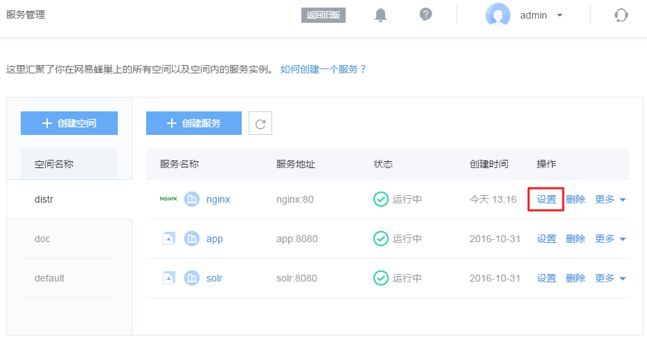
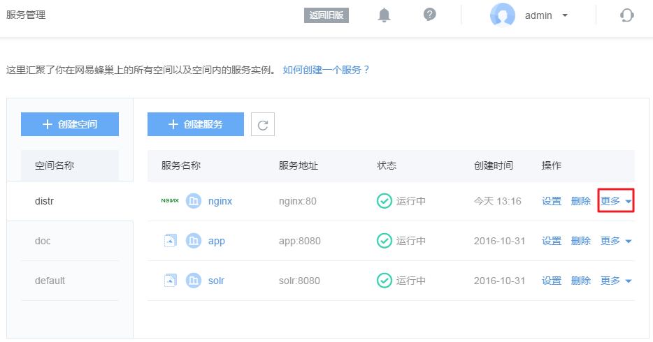

# 管理无状态服务

## 删除空间

点击左侧的导航菜单「服务管理」，进入服务管理页面，将鼠标移动到需要删除的空间名称，将显示「删除」按钮，点击即可删除对应空间。

Attention:
默认 default 空间无法删除
仅可删除空间内无服务的空间

## 删除服务

在服务管理页面，找到需要删除的服务，在右侧操作栏点击「删除」按钮即可删除服务。

## 设置服务

在服务管理页面，找到需要修改的服务，在右侧操作栏点击「设置」按钮即可设置服务。

目前支持的动态修改项：

* 环境变量
* 日志目录：注意

## 更多
目前在服务管理页面的操作栏，支持无状态服务的「更多」动态调整：

### 弹性伸缩

在线调整动态调整无状态服务的副本数量。

Note:
需要更多配额请提交工单申请

### 更改镜像版本

Note:
若使用的是收藏的镜像，源镜像访问权限已被修改，故无法更改镜像版本

### 更改规格

