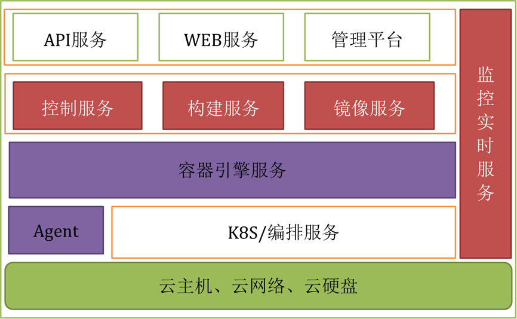
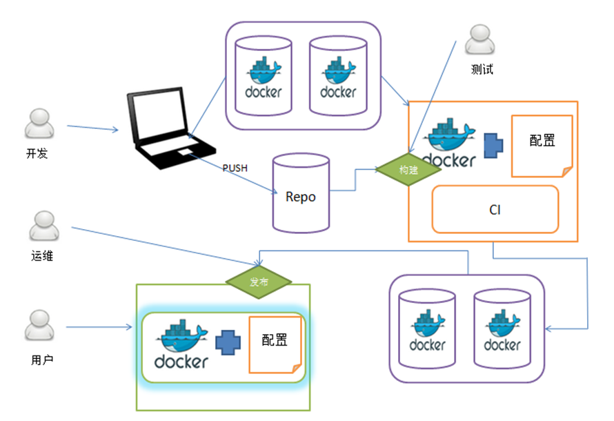

## 产品概述

容器服务是基于网易基础设施提供的 Docker 容器引擎服务平台，覆盖了软件开发过程中的开发、测试、演练、上线等生命周期管理，保持应用系统快速搭建和各环境的一致性。

容器技术可以处理不同平台之间的差异性，提供一个标准化的交付方式，统一配置，统一环境，保证效率，能有效的实现资源限制。此外，容器能够做到快速迁移，秒级高可用。容器服务能够对应用进行按需配置，秒级弹性伸缩，大大减少开发，测试及运维人员的环境搭建和应用创建的服务时间，提高工作效率，提高基础设施资源利用率，降低硬件和软件及人力成本。

## 系统架构

## 产品功能

容器服务主要有以下功能：

* 应用的生命周期管理
	* 提供源代码版本的拉取，编译，打包等版本化管理功能，支持静态动态资源运维部署；
	* 支持公共镜像和自定义应用的部署；
	* 支持负载均衡和根据应用负载实现自动扩容，支持应用的不停服和灰度发布；
	* 友好的运维工具，支持日志查询，性能展示，Shell 等服务功能；
	* 支持根据应用的负载，实现应用手工和自动秒级扩容；
	* 支持跨机房的多租户应用部署和隔离。
* 容器服务
	* 支持原生镜像和自定义镜像的容器创建功能；
	* 支持容器的外网绑定；
	* 支持容器的 SSH 登录；
	* 支持运行中的容器保存为镜像并部署。
* 镜像服务
	* 支持用户自定义镜像的上传和制作；
	* 提供不同镜像的历史记录。

## 产品特性

* 易用性
	* 提供可视性的操作和详情的日志列表，保证用户及时跟踪发布状态；
	* 提供丰富的 API 接口与管理接口，满足不同层次用户的发布需求。
* 扩展性
	* 系统之间采用微服务架构，没有强依赖，单独节点可独立部署工作，通过消息传递或 API 能完成工作流程跳转；
	* 各系统模块间支持多点部署并可以横向扩展，保证系统的高可用。
* 透明性
	* 用户操作过程和出错的信息通过监控报警，能快速查出问题的原因；
	* 系统本身监控所有的容器的生命周期；
	* 系统整体的运行状态和任务队列有详情统计数字，及时跟踪系统负载。
* 可靠性
	* 应用更新或回滚操作，保证操作的原子性；
	* 应用所有的操作都可以重入；
	* 应用发布的过程中，保证应用对外服务不间断和业务的连续性；
	* 容器服务等级指标 SLA 为 99.95%。

## 应用场景

* 开发人员可在应用程序和运行平台这两层进行应用程序的编码、构建、测试和发布；
* 测试人员可进行环境的快速搭建，测试环境的一致性和持续集成等工作；
* 运维人员可进行从硬件、操作系统到运行时平台的安装、配置、运行监控、升级和优化等工作。

开发 -> 测试 -> 运维的容器服务应用场景如图所示：

* 开发使用不同的镜像服务部署开发环境，方便本地开发环境的搭建和一致性；
* 测试通过使用镜像完成服务持续集成，简化测试环境的搭建；
* 运维使用同一份镜像服务部署，保持环境的一致性，也可以制作镜像并进行快速部署;在应用大流量的情况，能做到秒级的扩容；
* 开发者用户通知镜像能够方便的进行个人性应用的创建，如博客，知识库等。