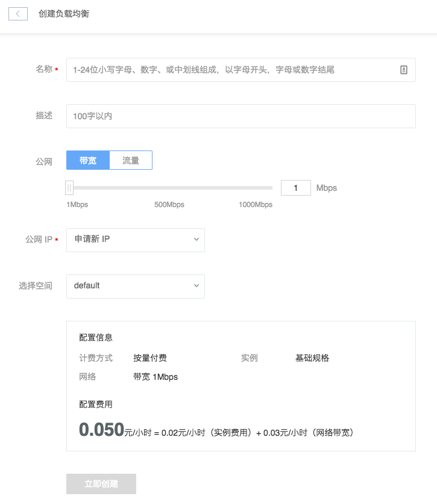
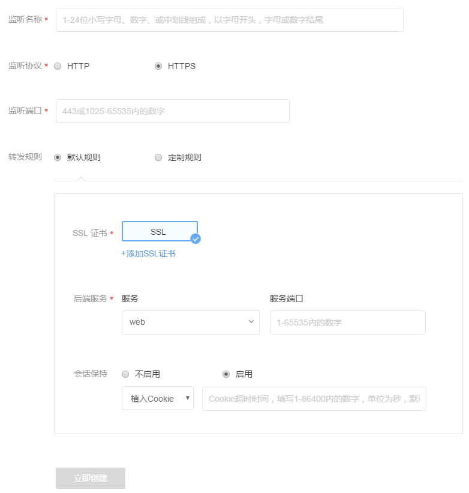
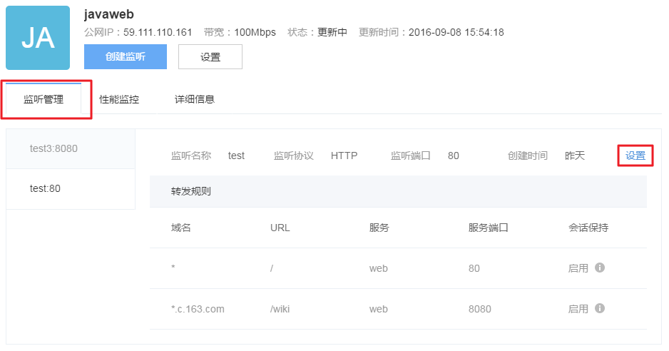

## 创建负载均衡

点击左侧的导航菜单「负载均衡」，进入负载均衡实例列表页，点击「创建负载均衡」按钮，进入负载均衡创建页面，如下图所示：

注：请选择正确的空间，负载均衡的后端服务必须对应空间 -> 如何创建空间

## 创建监听

创建完毕后，「创建监听」按钮即可使用。点击该按钮，跳转到创建监听页面。填写完相应信息后，点击「立即创建」即可：

注：默认单个实例监听上限为 20 组，如果需要更多监听，请 提交工单申请 。

### 监听协议
目前支持 HTTP 和 HTTPS 协议，使用 HTTPS 协议，需在下方 添加 SSL 证书。

### 监听端口
* HTTP 使用 80 或 1025 - 65535 内数字
* HTTPS 使用 443 或 1025 - 65535 内数字

### 转发规则
**后端服务**为创建负载均衡时选择的空间内的后端服务。

**会话保持**可以选择「不启用」或「启用」，默认为「不启用」。

启用会话保持可以「植入 Cookie」或「改写 Cookie」：

* 植入 Cookie：负载均衡服务自动生成 cookie，可以指定超时时间，单位为 S。不填则默认为会话 Cookie；
* 改写 Cookie：改写用户指明的 cookie，如果没有对应 Cookie 说明不使用会话保持。

#### 默认规则

默认转发所有请求。

#### 定制规则

**目前使用订制规则，请先添加一条域名为「*」，URL为「/」的通配规则。**

**按域名：**每组监听可以设置多个域名，域名支持完整域名和通配符，以 c.163.com 为例，格式如下所示：

* c.163.com 精确匹配 c.163.com 域名
* *.163.com 匹配所有以 163.com 结尾的域名
* c.163.* 匹配所有以 c.163 开始的域名
注意： 如果开启了域名匹配，但请求的域名匹配不到任意一条规则，会返回 403。

**URL配置**：使用前缀匹配,支持「/」, 可以在最后加入「$」来做完整匹配。

## 监听设置

点击「负载均衡详情」中的「监听管理」标签，可以查看所添加的监听和监听详情，如下图所示：

点击相应监听中右侧的「设置」按钮，即可对监听进行设置（支持修改转发规则和删除监听）。