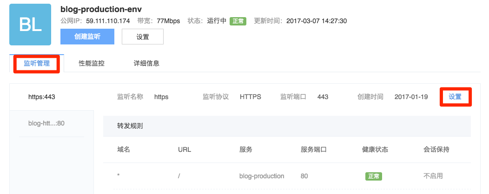

# 设置监听

在负载均衡列表点击需要修改监听的负载均衡名称，进入负载均衡详情页，点击「负载均衡详情」中的「监听管理」标签，可以查看所添加的监听和监听详情，如下图所示：

点击相应监听中右侧的「设置」按钮，即可对监听进行设置，目前支持：
* 修改转发规则
* 修改健康检查，详见 [配置健康检查](http://support.c.163.com/md.html#!容器服务/负载均衡/运维指南/配置负载均衡健康检查.md)
* 删除监听