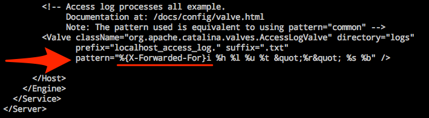

# 获取真实 IP（Linux）

网易蜂巢负载均衡在将请求转发给后端时，会将请求头插入 X-Forwarded-For 请求头，后端服务可以通过查询该 HTTP 头来获取原始 IP 地址。

##  1. Nginx 配置方案
### 1.1. 确认 http_realip_module 模块已安装

Nginx 使用 [http_realip_module](http://nginx.org/en/docs/http/ngx_http_realip_module.html) 模块来获取真实 IP。yum 或 apt-get 安装的 Nginx 一般都包含该模块。某些一键包安装可能未包含该模块。

Note:
网易蜂巢 [Nginx 官方镜像](https://c.163.com/hub#/m/repository/?repoId=3181) 包含该模块无需重新编译安装

通过 `nginx -V` 命令查看是否安装，若未安装建议通过 yum 或 apt-get 重新安装 Nginx。

### 1.2. 获取负载均衡内网 IP

根据 Nginx 日志获取负载均衡的内网 IP 用于设置 `set_real_ip_from`。

	tail /var/log/nginx/access.log

### 1.3. 修改 nginx.conf 配置文件

	vi /etc/nginx/nginx.conf
	
在 `http {}` 内添加以下字段：

	set_real_ip_from 获取到的负载均衡内网IP;
	real_ip_header X-Forwarded-For;

Note:
set_real_ip_from 的 IP 来自 1.2.中获取的负载均衡内网 IP；
该内网 IP 如有多个，则都需要添加；
该内网 IP 会随着配置更改等原因变动，可以设置为租户内网网段（使用 ifconfig 查看内网 IP 根据掩码计算即可）。

### 1.4. 重启 Nginx

	service nginx restart	

更多该模块的说明，详见 [http_realip_module](http://nginx.org/en/docs/http/ngx_http_realip_module.html) 。

## 2. Apache 配置方案
### 2.1. 安装 [mod_rpaf](https://github.com/gnif/mod_rpaf) 模块

	wget https://github.com/gnif/mod_rpaf/archive/stable.zip
	unzip stable.zip
	cd mod_rpaf-stable

* Debian/Ubuntu 
		apt-get install build-essential apache2-threaded-dev
		make
		make install  

* RedHat/CentOS
		yum install httpd-devel
		make
		make install

### 2.2. 获取负载均衡内网 IP

根据 Apache 日志获取负载均衡的内网 IP 用于设置 `RPAF_ProxyIPs`。

	tail /var/log/apache2/access.log

### 2.3. 修改 apache2.conf 配置文件

	vi /etc/apache2/apache2.conf
	
在最下方添加以下字段：

	LoadModule rpaf_module /usr/lib/apache2/modules/mod_rpaf.so
	RPAF_Enable On
	RPAF_SetHostName On
	RPAF_ProxyIPs 获取到的负载均衡内网IP
	RPAF_Header X-Forwarded-For

Note:
RPAF_ProxyIPs 的 IP 来自 2.2.中获取的负载均衡内网 IP；
该内网 IP 如有多个，则都需要添加；
该内网 IP 会随着配置更改等原因变动，可以设置为租户内网网段（使用 ifconfig 查看内网 IP 根据掩码计算即可）。

### 2.4. 重启 Apache

	service apache2 restart

更多该模块的说明，详见 [mod_rpaf](https://github.com/gnif/mod_rpaf)。

## 3. Tomcat7 配置方案
### 3.1. 修改 server.xml 配置文件

	vi /etc/tomcat7/server.xml

在配置文件底部 pattern 中插入 `%{X-Forwarded-For}i` 字段（即：将 pattern 字段修改为 `pattern="%{X-Forwarded-For}i %h %l %u %t "%r" %s %b" />`）

### 3.2. 重启 Tomcat7

	service tomcat7 restart

