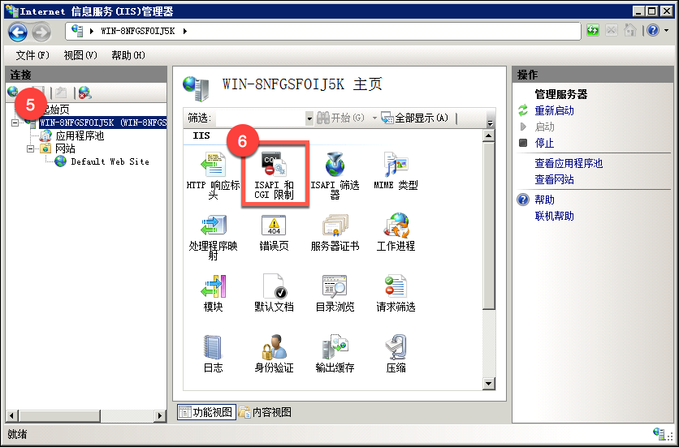
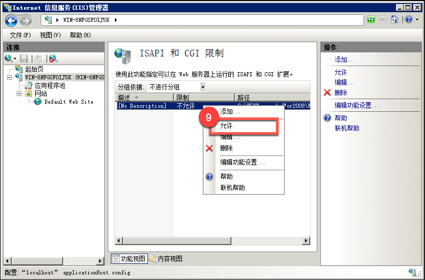

# 获取真实 IP（Windows）

网易蜂巢负载均衡在将请求转发给后端时，会将请求头插入 X-Forwarded-For 请求头，后端服务可以通过查询该 HTTP 头来获取原始 IP 地址。

Note:
蜂巢官方镜像 WindowsServer2008 是64位系统，默认 Web 服务器是 IIS7；
蜂巢官方镜像 WindowsServer2012 是64位系统，默认 Web 服务器是 IIS8；
未开启「ISAPI 和 CGI 限制」、「ISAPI 筛选器」请在服务管理器内添加该角色服务。

## 1. IIS7 配置方案

### 1.1. 下载 F5XForwardedFor.dll

下载 [F5XForwardedFor.dll](http://cloudcomb-wiki.nos-eastchina1.126.net/F5XForwardedFor.dll)，保存到某个目录（本示例中为 `C:\F5XForwardedFor2008`）并确保 IIS 进程对该目录拥有读取权限。

### 1.2. 添加「ISAPI 筛选器」

1.2.1. 打开 IIS ➡ 选择服务器 ➡ 双击「ISAPI 筛选器」:

1.2.2. 在右侧操作栏点击「**添加**」添加筛选器；

1.2.3. 自定义筛选器名称，选择「**可执行文件**」（本示例中为 `C:\F5XForwardedFor2008\F5XForwardedFor.dll`）：

### 1.3. 添加「ISAPI 和 CGI 限制」

1.3.1. 打开 IIS ➡ 选择服务器 ➡ 双击「**ISAPI 和 CGI 限制**」:

1.3.2. 在右侧操作栏点击「**添加**」；

1.3.3. 选择「**ISAPI 或 CGI 路径**」（本示例中为 `C:\F5XForwardedFor2008\F5XForwardedFor.dll`）：

### 1.4. 启用「ISAPI 和 CGI 限制」

右键点击之前添加的内容，选择「**允许**」：

### 1.5. 查看日志文件中的真实 IP

IIS 日志默认路径：`C:\inetpub\logs\LogFiles`。

