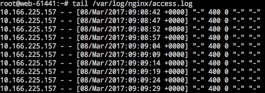
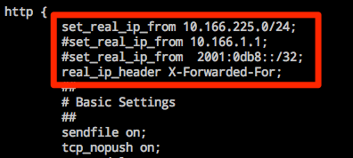

# 获取真实 IP

网易蜂巢负载均衡在将请求转发给后端时，会将请求头插入 X-Forwarded-For 请求头，后端服务可以通过查询该 HTTP 头来获取原始 IP 地址。

##  1. Nginx 配置方案

### 1.1. 确认 http_realip_module 模块已安装

Nginx 使用 [http_realip_module](http://nginx.org/en/docs/http/ngx_http_realip_module.html) 模块来获取真实 IP。yum 或 apt-get 安装的 Nginx 一般都包含该模块。某些一键包安装可能未包含该模块。

Note:
网易蜂巢 [Nginx 官方镜像](https://c.163.com/hub#/m/repository/?repoId=3181) 包含该模块无需重新编译安装

通过 `nginx -V` 命令查看是否安装，若未安装建议通过 yum 或 apt-get 重新安装 Nginx。

### 1.2. 获取负载均衡内网 IP

根据 Nginx 日志获取负载均衡的内网 IP 用于设置 `set_real_ip_from`。

	tail /var/log/nginx/access.log

### 1.3. 修改 nginx.conf 配置文件

	vi /etc/nginx/nginx.conf
	
在 `http {}` 内添加以下字段：

	set_real_ip_from 获取到的负载均衡内网IP;
	real_ip_header X-Forwarded-For;

Note:
set_real_ip_from 的 IP 来自 1.2.中获取的负载均衡内网 IP；
该内网 IP 如有多个，则都需要添加；
该内网 IP 会随着配置更改等原因变动，可以设置为租户内网网段（使用 ifconfig 查看内网 IP 根据掩码计算即可）。

### 1.4. 重启 Nginx

	service nginx restart	

更多该模块的说明，详见 [http_realip_module](http://nginx.org/en/docs/http/ngx_http_realip_module.html) 。

