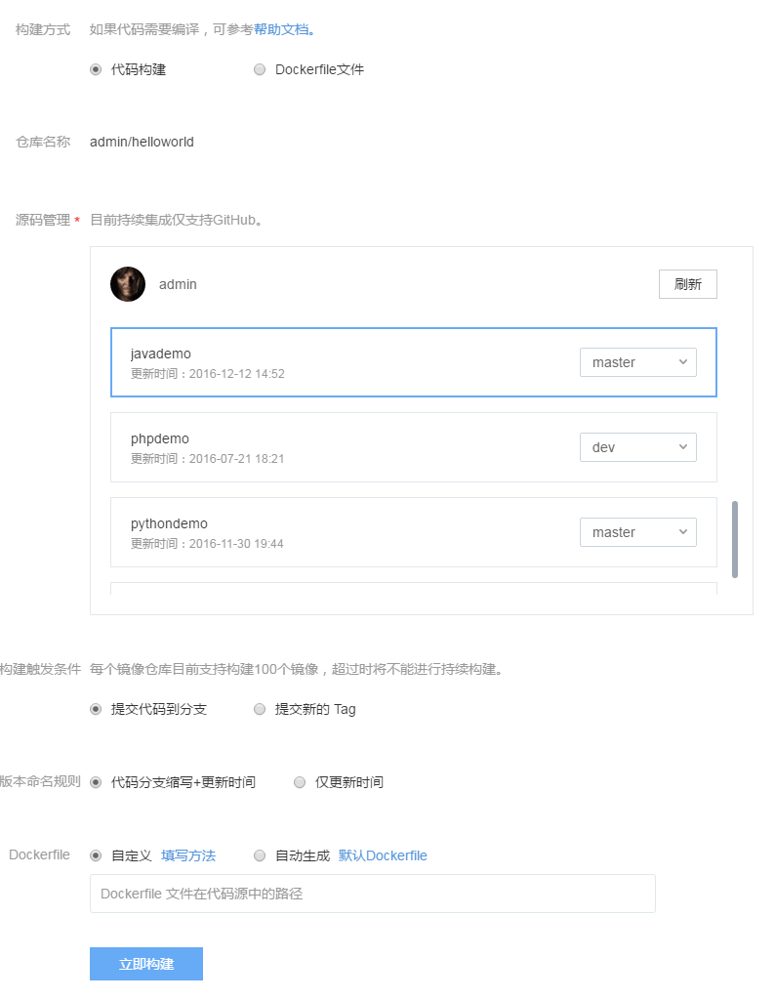
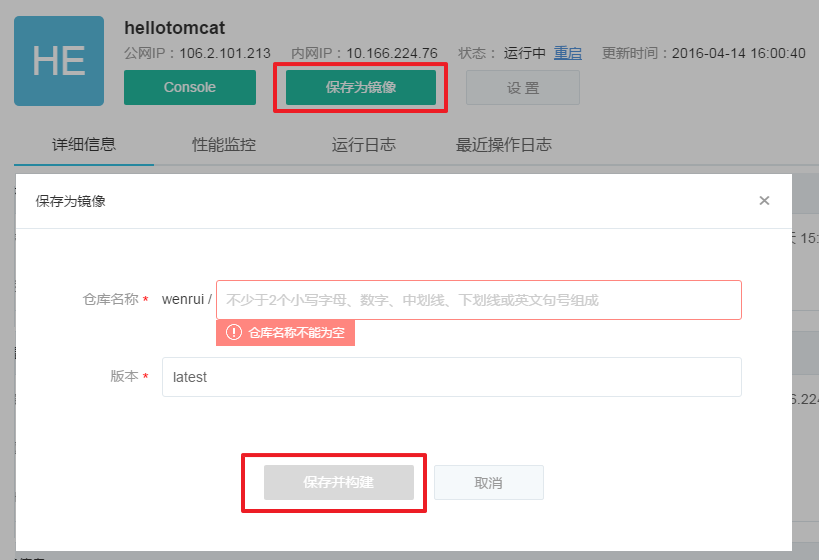

# 创建自定义镜像

蜂巢支持用户使用自定义镜像，本文将详细介绍如何在蜂巢创建自定义镜像。创建自定义镜像前，一般需要创建私有镜像仓库，步骤如下：

1、登录 [蜂巢控制台](https://c.163.com/dashboard#/m/overview/)；

2、点击左侧导航菜单的「镜像仓库」标签；

3、点击镜像仓库列表左上角的「创建镜像仓库」按钮：

* 仓库名称（必填），命名规则如下：
    * 使用小写字母、数字、中划线、下划线、英文句号；
    * 以字母或数字开头结尾；
    * 不少于 2 个字符；
    * 不包含连续的特殊字符。
    * `<username>/<repo_name>` 的总长度不能超过 255 个字符（其中 username 为用户名，repo_name 为你填写的仓库名称。例如对于镜像 nofrish/nginx 来说，长度为 13 而不是 5）。
* 访问权限（必填，默认私有）：
    * 私有：仅用户本人可以下载和使用该镜像仓库中的镜像；
    * 公开：所有用户都可以下载和使用该镜像仓库中的镜像。
* 基本描述（非必填，默认为空）:
    * 100 字符以内；
* 详细信息（非必填，默认为空）：
    * 支持 Markdown，语法参考：[《Markdown 语法说明》](http://www.appinn.com/markdown/)。

Note:
镜像仓库一旦创建完成后，无法修改其支持集成属性。
支持持续构建的镜像仓库，访问权限必须为私有。
「Docker 客户端构建自定义镜像」和「蜂巢容器保存为自定义镜像（老版）」不在控制台的镜像仓库页面操作，也无需提前创建镜像仓库。

镜像仓库创建完成后，即可在蜂巢构建自定义镜像，目前有以下五种方式：

* 代码构建自定义镜像（持续集成）
* 代码构建自定义镜像
* Dockerfile 构建自定义镜像
* Docker 客户端构建自定义镜像
* 蜂巢容器保存为自定义镜像（老版）

Note:
若镜像版本名存在则构建后直接覆盖原有镜像版本。
在镜像仓库内构建镜像，都将输出构建日志，你可以根据构建日志排错。

## 一、代码构建自定义镜像（持续集成）
Note:
需要镜像仓库支持持续集成（目前仅支持 GitHub）。

1、进入需要构建镜像的镜像仓库，点击「构建镜像」按钮；

2、构建方式选择「代码构建」：

3、选择源码及分支；

4、设定构建出发条件：「提交代码到分支」或「提交新的 Tag」；

5、设定镜像的版本命名规则；

6、选择 [自定义 Dockerfile](http://support.c.163.com/md.html#!容器服务/镜像仓库/使用技巧/自定义Dockerfile填写方法.md) 或者 [默认 Dockerfile](http://support.c.163.com/md.html#!容器服务/镜像仓库/使用技巧/默认 Dockerfile.md)；

7、确认信息，点击「提交并构建」按钮，开始构建自定义镜像。

Attention:
若遇到构建失败的情况，请根据构建日志，修改自己的项目，再 push 到 GitHub 后将自动触发构建。
若遇到点击「立即构建」按钮后，出现提示「系统繁忙」，请确认你的 GitHub 项目 - Settings - Webhooks 内是否已达到 20 条上限；
若你需要重复构建同一个版本，我们不建议你在控制台重新走一遍构建流程，这样会增加 Webhooks 导致出现以上问题。

## 二、代码构建自定义镜像

1、进入需要构建镜像的镜像仓库，点击「构建镜像」按钮；

2、构建方式选择「代码构建」：

3、输入新的版本号，填写代码的 Git 或 SVN 地址等信息；

4、选择 [自定义 Dockerfile](http://support.c.163.com/md.html#!容器服务/镜像仓库/使用技巧/自定义Dockerfile填写方法.md) 或者 [默认 Dockerfile](http://support.c.163.com/md.html#!容器服务/镜像仓库/使用技巧/默认 Dockerfile.md)；

5、确认信息，点击「提交并构建」按钮，开始构建自定义镜像。

## 三、Dockerfile 构建自定义镜像

1、进入需要构建镜像的镜像仓库，点击「构建镜像」按钮；

2、构建方式选择「Dockerfile文件」；

3、在构建镜像页面，设置版本号、上传本地 Dockefile 文件：

4、确认信息，点击「提交并构建」按钮，开始构建自定义镜像。

## 四、Docker 客户端构建自定义镜像

1、创建本地镜像：

* 从 [蜂巢镜像中心、Docker Hub](https://c.163.com/hub#/m/home/) 等下载各种镜像；
* 使用 Dockerfile 构建本地镜像等；
* 其他方式构建本地镜像。

2、使用 docker tag 命令给镜像打标签，重新指定镜像仓库；

3、[推送本地镜像至蜂巢](http://support.c.163.com/md.html#!容器服务/镜像仓库/使用指南/推送本地镜像.md)。

## 五、蜂巢容器保存为自定义镜像（老版）
Note:
新版有状态服务即将支持保存自定义镜像，敬请期待。

1、登录 [蜂巢控制台](https://c.163.com/dashboard#/m/overview/)；

2、点击左侧导航菜单的「容器管理」标签；

3、点击需要保存的容器，进入「容器详情」页；

4、点击「保存为镜像」按钮，设置相关信息：

* 仓库名称（必填），命名规则如下：
    * 使用小写字母、数字、中划线、下划线、英文句号；
    * 以字母或数字开头结尾；
    * 不少于 2 个字符；
    * 不包含连续的特殊字符。
    * `<username>/<repo_name>` 的总长度不能超过 255 个字符（其中 username 为用户名，repo_name 为你填写的仓库名称。例如对于镜像 nofrish/nginx 来说，长度为 13 而不是 5）。
* 版本（必填），命名规则如下：
    * 默认 latest；
    * 100 个字符以内；
    * 若版本名存在，则构建后直接覆盖原有镜像。

5、确认信息，点击「保存并构建」按钮，开始构建自定义镜像。

