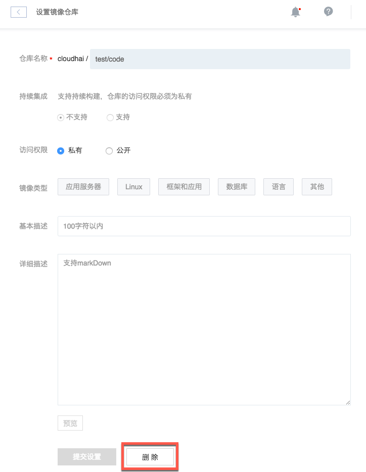

# 删除镜像仓库

Attention:
删除后将失去镜像仓库中所有版本且无法恢复；
依赖该镜像仓库的容器服务（第三方或自己的），将无法重建（影响高可用）、弹性伸缩等。

## 操作步骤

1. 登录 [控制台](https://c.163.com/dashboard#/m/mirrorRepo/)，定位「**镜像仓库**」标签；
2. 定位到需要删除的镜像仓库；
3. 点击右侧的「**设置**」按钮：

4. 确认需要删除的镜像仓库，点击底部「删除」按钮：
