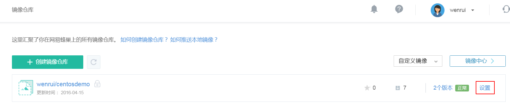

# 常见问题

### 能通过本地 Docker 客户端上传镜像吗？

可以，具体请参考 推送本地镜像。

### 镜像存储安全吗？

蜂巢的后端存储系统提供了至少 99.99999% 以上的数据安全性。

### 如何创建镜像？

进入「镜像仓库」，点击「创建镜像」，填写镜像名称、标签等信息，然后上传 Dockerfile 即可。 具体可参见 创建镜像。

### 如何删除镜像仓库中的镜像？

进入镜像仓库，点击相应镜像的「设置」按钮，点击「删除」按钮即可。

### 镜像创建后是否可以修改？哪些可以修改？

可以。点击相应镜像的「设置」按钮,可以重新设置镜像的标签、描述 。

### 忘记创建的镜像是什么时，该怎么办？

点击想查看镜像的「设置」，点击 Dockerfile 的「查看」，将 Dockerfile 下载下来，即可通过 Dockerfile 来判断。通过 Docker 客户端本地提交的镜像，不支持查看功能，如果要修改，则直接上传即可。

### 是否可以修改已创建的镜像？

可以。进入相应镜像的「设置」页面，点击 Dockerfile 的「重新上传」即可。

### 构建失败，日志提示「私有网 IP 绑定失败」

这往往是由于你的镜像无法启动导致，请在本地使用以下命令确认镜像可以正常启动：

    docker run [镜像名称或 ID]

注：若使用 dockerfile，请在本地使用 dockerfile 构建镜像再运行尝试。