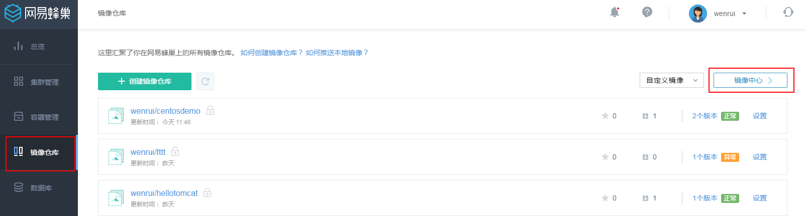
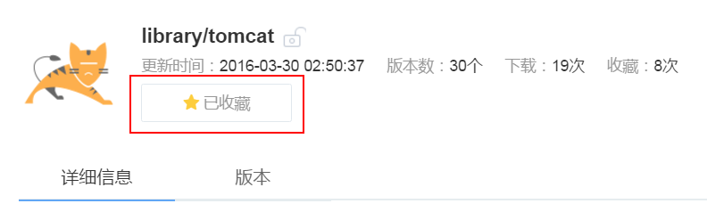
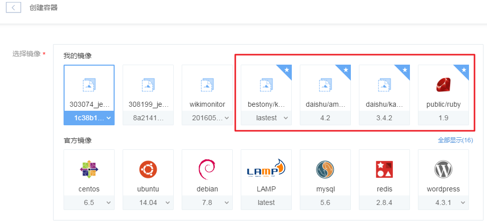

蜂巢镜像中心为开发者提供公共镜像仓库服务，登录后即可对公开镜像进行收藏和部署。我们提供丰富的各类镜像资源，你可以搜索、收藏、下载所需的镜像。

目前，蜂巢提供三种类型镜像：

* Dockerhub 官方镜像
* 蜂巢官方镜像
* 蜂巢用户公开的镜像

### 
 >>> 点击进入蜂巢镜像中心 <<< 

### **镜像中心入口**

* 蜂巢官网首页顶部「镜像中心」标签：：

* 控制台「镜像仓库」，右侧「镜像中心」按钮：

### 收藏镜像

进入镜像中心后，点击所需的镜像名称，跳转到该镜像详情页面。

点击「收藏」按钮，当按钮内容变为「已收藏」时，表示你已经成功收藏该镜像，如下图示：

### 使用收藏的镜像

在创建容器或集群选择镜像时，右上角带星号的镜像，即为收藏的镜像：

详见：

> 如何创建容器

> 如何创建集群