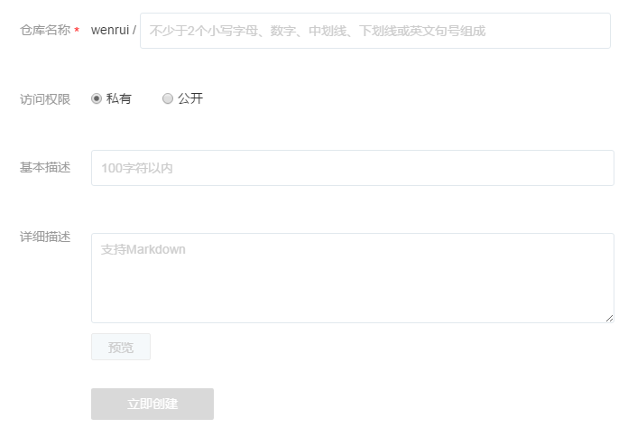

# 创建自定义镜像

## 简介

蜂巢支持用户使用自定义镜像，本文将详细介绍如何在蜂巢创建自定义镜像。目前在蜂巢创建自定义镜像有以下五种方式：

* 代码构建自定义镜像（持续集成）
* 代码构建自定义镜像
* Dockerfile 构建自定义镜像
* Docker 客户端构建自定义镜像
* 蜂巢容器保存为自定义镜像（老版）

Note:
镜像版本更新、覆盖也可以通过以上方式进行。

## 一、代码构建自定义镜像（持续集成）

## 二、代码构建自定义镜像

1.登录[蜂巢控制台](https://c.163.com/dashboard#/m/overview/)；

2.点击左侧导航菜单的「镜像仓库」标签；

3.点击镜像仓库列表中对应镜像的名称，进入镜像仓库详情页，点击「构建镜像」按钮，如下图所示：

4.输入新的版本号，构建方式默认选择「代码构建」，按需选择合适的基础镜像，并填写代码的 Git 或 SVN 地址等信息。填写完毕后，点击「提交并构建」即可。

## 三、Dockerfile 构建自定义镜像

1.登录 [蜂巢控制台](https://c.163.com/dashboard#/m/overview/)；

2.点击左侧导航菜单的「镜像仓库」标签；

3.点击镜像仓库列表左上角的「创建镜像仓库」按钮：

* **仓库名称**（必填），命名规则如下：
    * 使用小写字母、数字、中划线、下划线、英文句号；
    * 以字母或数字开头结尾；
    * 不少于 2 个字符；
    * 不包含连续的特殊字符。
    * <username>/<repo_name> 的总长度不能超过 255 个字符（其中 username 为用户名，repo_name 为你填写的仓库名称。例如对于镜像 nofrish/nginx 来说，长度为 13 而不是 5）。
* **访问权限**（必填，默认私有）：
    * 私有：仅用户本人可以下载和使用该镜像仓库中的镜像；
    * 公开：所有用户都可以下载和使用该镜像仓库中的镜像。
* **基本描述**（非必填，默认为空）
* **详细信息**（非必填，默认为空）：
    * 支持 Markdown，语法参考：[《Markdown 语法说明》](http://www.appinn.com/markdown/)。

4.进入创建完成的镜像仓库，点击「构建镜像」按钮：

Note:
使用已经构建镜像的仓库时，若版本名存在则构建后直接覆盖原有镜像。

5.在构建镜像页面，设置版本号、上传本地 Dockefile 文件：

6.确认信息，点击「提交并构建」按钮，开始创建自定义镜像。

## 四、Docker 客户端构建自定义镜像

1、创建本地镜像：

* 从 [蜂巢镜像中心、Docker Hub](https://c.163.com/hub#/m/home/) 等下载各种镜像；
* 使用 Dockerfile 构建本地镜像等；
* 其他方式构建本地镜像。

2、使用 docker tag 命令给镜像打标签，重新指定镜像仓库；

3、[推送本地镜像至蜂巢](http://support.c.163.com/md.html#!容器服务/镜像仓库/使用指南/推送本地镜像.md)。

## 五、蜂巢容器保存为自定义镜像（老版）
Note:
新版有状态服务即将支持保存自定义镜像，敬请期待。

1、登录 [蜂巢控制台](https://c.163.com/dashboard#/m/overview/)；

2、点击左侧导航菜单的「容器管理」标签；

3、点击需要保存的容器，进入「容器详情」页；

4、点击「保存为镜像」按钮，设置相关信息：

* 仓库名称（必填），命名规则如下：
    * 使用小写字母、数字、中划线、下划线、英文句号；
    * 以字母或数字开头结尾；
    * 不少于 2 个字符；
    * 不包含连续的特殊字符。
    * \<username>/\<repo_name> 的总长度不能超过 255 个字符（其中 username 为用户名，repo_name 为你填写的仓库名称。例如对于镜像 nofrish/nginx 来说，长度为 13 而不是 5）。
* 版本（必填），命名规则如下：
    * 默认 latest；
    * 100 个字符以内；
    * 若版本名存在，则构建后直接覆盖原有镜像。

5、确认信息，点击「保存并构建」按钮，开始创建自定义镜像。

