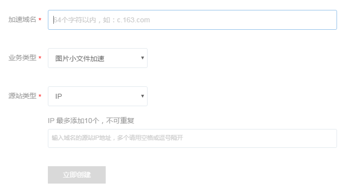
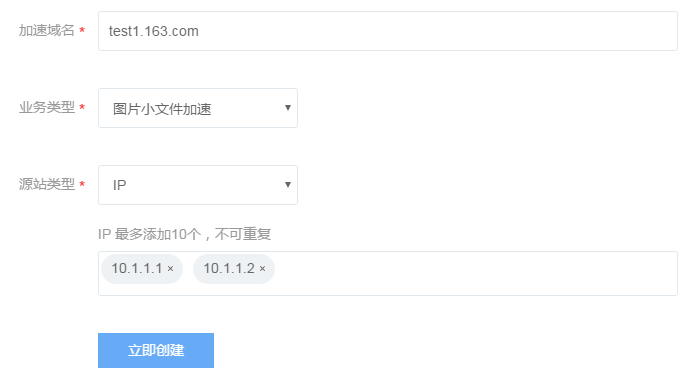
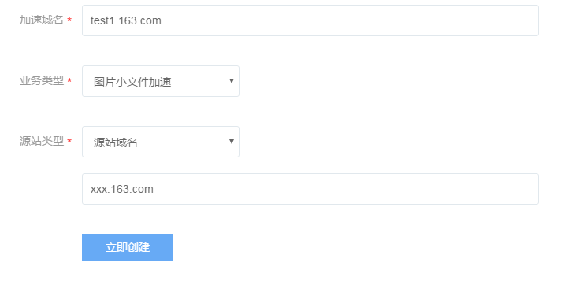
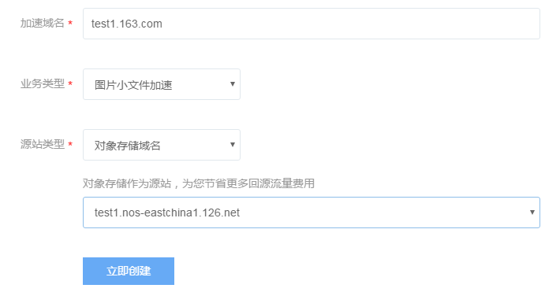
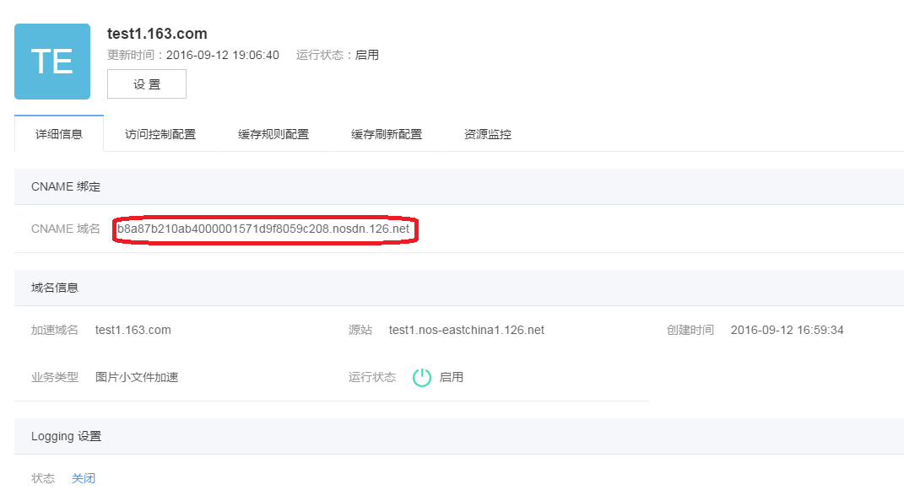

## 前言

### 目的

本文档记录了内容分发网络(Cloud Delivery Network，简称 CDN)的基本概念、控制台使用等，旨在帮助CDN的使用者了解CDN的功能，以及日常使用。

### 读者

使用CDN产品的运维人员以及开发人员。

### 术语和定义
域名：域名是Internet网络上的一个服务器或一个网络系统的名字，全世界，没有重复的域名。
CNAME记录：它是一个别名记录( Canonical Name )；当 DNS 系统在查询 CNAME 左面的名称的时候，都会转向 CNAME 右面的名称再进行查询，一直追踪到最后的 PTR 或 A 名称，成功查询后才会做出回应，否则失败。
DNS：DNS即Domain Name System，是域名解析服务的意思。它在互联网的作用是：把域名转换成为网络可以识别的ip地址。人们习惯记忆域名，但机器间互相只认IP地址，域名与IP地址之间是一一对应的，它们之间的转换工作称为域名解析，域名解析需要由专门的域名解析服务器来完成，整个过程是自动进行的。

## 快速入门

### 进入控制台
进入控制台后，点击左侧列表中「CDN」项进入 CDN 控制台页面。

### 创建加速域名

如上图所示，进入CDN控制台页面后，点击“创建加速域名”进入如下图所示界面。

#### 填写加速域名
你输入的域名必须是备案完成的，正在备案的域名无法接入。

域名内容需符合CDN业务规范。

支持泛域名加速，不支持中文域名加速。

#### 选择业务类型=
* **图片小文件加速**：若加速内容多为图片及网页文件，推荐使用图片小文件加速
* **大文件下载加速**：若加速内容为大文件（一般来说20M以上的静态文件属于大文件范畴），推荐使用大文件加速下载
* **流媒体加速**：若大文件为音视频文件，加速视频的点播业务，推荐使用流媒体加速方式

#### 选择源站类型
* **IP地址**

可写多个服务器外网 IP

* **源站域名** 

输入源站域名

注意：源站地址不能与加速域名相同，例如您的加速域名为 test.yourdomain.com，建议将资源源站设置为 src.yourcompany.com
* **NOS域名**

可选择已经存在的NOS桶域名

信息填写完成后，点击“立即创建”提交创建信息。

### CNAME 配置
启用 CDN 加速服务，需要将您的域名指向加速域名，再由加速域名来提供 IP 地址， 需要在 DNS 服务商处为域名添加 CNAME 记录，从而达到内容分发加速的效果。

主机记录为加速域名

记录值为 CNAME 域名，见域名详情页，如下图所示：

