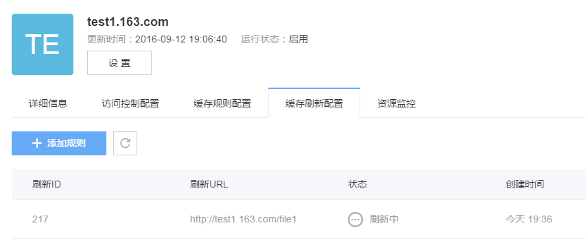
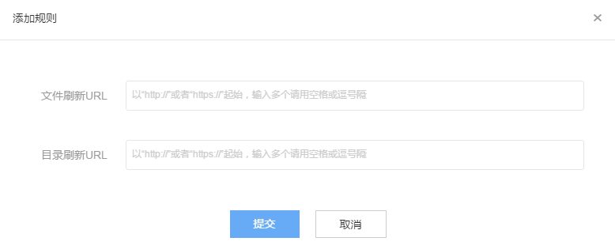

# 缓存刷新配置
在加速域名详情页中，点击“缓存刷新配置”进入缓存刷新规则列表。

如果源站改变内容后希望快速更新CDN服务节点上的缓存副本，可以使用缓存刷新功能。 当前支持两种刷新方式：目录刷新(dir-url)以及文件刷新(file-url)， 不论是刷新一个URL还是刷新多个URL推荐都使用目录刷新方式。

目录刷新：将会把指定目录本身以及目录下的所有url在CDN服务节点上的缓存副本设置为过期，当有新的请求发送至服务节点后，CDN节点会单上if-Modifyed-since请求头去回源确认是否更新(通过比较Last-Modifyed或者E-Tag标签)。如果文件有更新，则拉取最新的内容至节点，如果文件没有更新，则继续使用节点上的缓存内容。

文件刷新: 将会把指定URL在缓存服务节点上的缓存副本直接清除，当有新的请求发送至服务节点后，就会回源重新获取文件。

## 添加规则

点击「添加规则」，进入如下界面对添加刷新规则：

