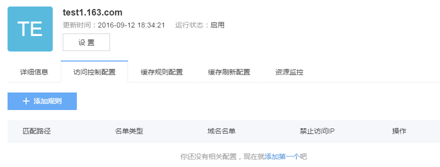
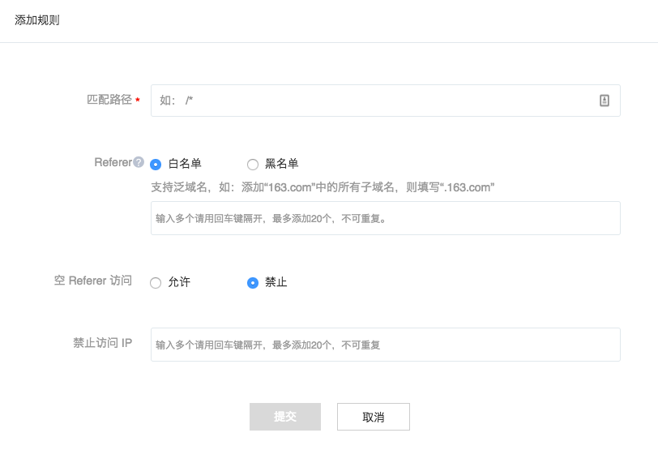
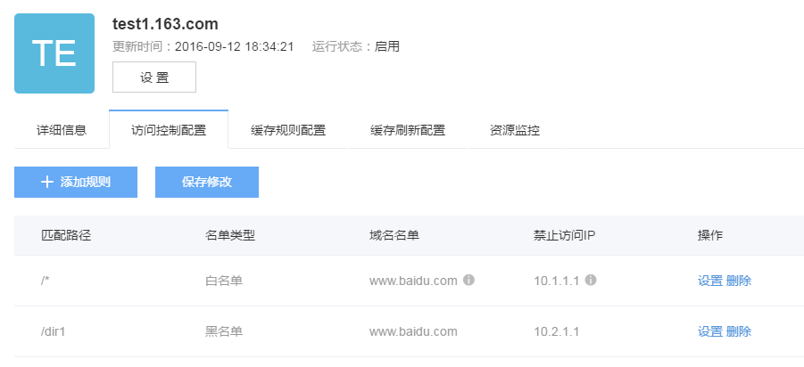

## 访问控制配置

在加速域名详情页，点击「访问控制配置」进入访问控制配置页。

CDN对加速域名，可以提供包括黑名单referer，白名单referer，禁止访问IP这三种访问控制规则，保护用户的资源不被窃用。

CDN支持 多条访问控制规则 ，系统会逐条判断，只有符合全部访问规则的请求才允许访问。

|访问控制功能	  |                         **作用**                         |
|-----------------|----------------------------------------------------------|
|黑名单referer    |防止某一些网站非法引用访问资源	                         |
|白名单referer    |允许信任的网站访问	                                     |        
|禁止Ip访问       |针对性地访问禁止某些非法IP或者肉机IP的访问	             |

  
注意：在访问控制配置中，所有添加、设置、删除操作，在操作完成后均需点击「保存修改」后才会被提交。

## 添加规则

点击「添加规则」，进入下图所示界面：

您可以对如下信息进行配置：
1. 匹配路径

当用户设置访问控制规则时，需要指定具体路径下（即<path-pattren>）资源的缓存时间， path-pattern支持模糊正则，可进行诸如”/(a|b/*.(jpg|bmp|png|gif))”等正则规则的设定。 模糊正则的含义如下：

|path-pattern	  |                         **含义**                         |
|-----------------|----------------------------------------------------------|
| /*.jpg          |所有的jpg文件，也包含/xx/等子目录下的所有jpg文件	         |
| gif)            |所有的jpg和gif文件，也包含/xx/等子目录下的所有jpg文件	 |        
| /a/*            |目录/a下的所有文件，也包含/a/xx/等子目录下的所有文件。	 |
| b)/*.jpg	      |b)/xx/x下所有jpg文件。	                                 | 

2. Referer 设置

Referer 设置用于防盗链功能， 防盗链功能基于 HTTP 协议支持的 Referer 机制，通过 referer 跟踪来源，对来源进行识别和判断，用户可以通过配置访问的 referer 黑白名单来对访问者身份进行识别和过滤，从而限制 CDN 资源被访问的情况， 目前防盗链功能支持黑名单或白名单机制，访客对资源发起请求后，请求到达 CDN 节点，CDN 节点会根据用户预设的防盗链黑名单或白名单，对访客的身份进行过滤，符合规则可以顺利请求到资源；若不符合规则， 该访客请求被禁止。 黑名单referer主要防止其他网站非法引用本域名下的一些资源。

白名单referer与黑名单referer相反，为允许指定rerferer的请求进行访问。<referer>不支持通配符。例如，可以输入 .google.com，即表示*.google.com。

3. 禁止访问 IP 设置

http referer 是可以伪造的，在客户端等非浏览器访问下可以很轻松得进行篡改。这个时候可以通过设置禁止ip的方式防止盗链或者盗刷。

禁止Ip访问支持网段，但是不支持通配符。例如，输入网段192.168.23.0/24，那么，该网段都禁止访问；如输入192.168.23.*，API接口会接受，但不会执行成功

## 设置已有规则

在需要进行设置的规则项，点击「设置」可对规则进行变更设置。
## 删除规则

在需要进行设置的规则项右侧，点击「删除」可删除已有访问控制规则。

