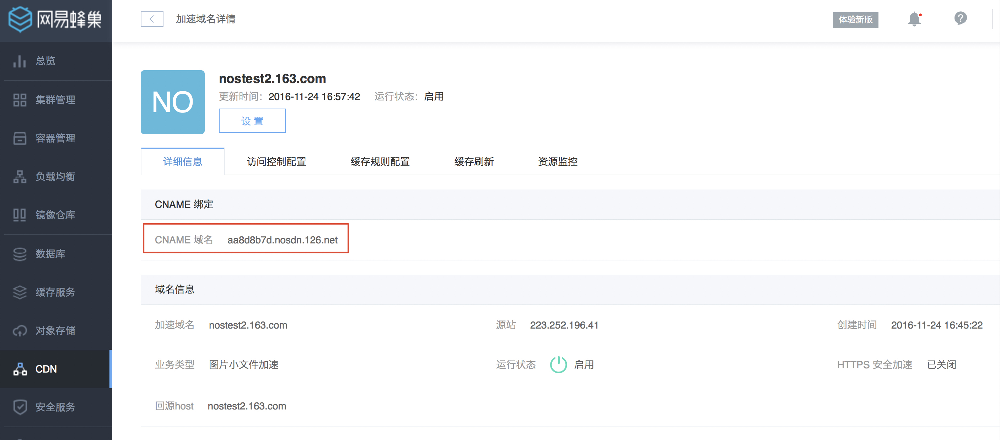
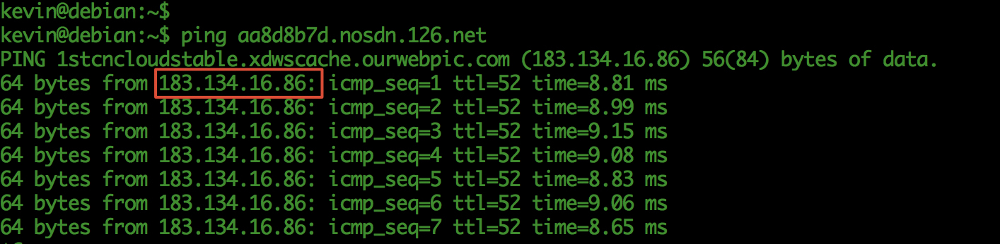
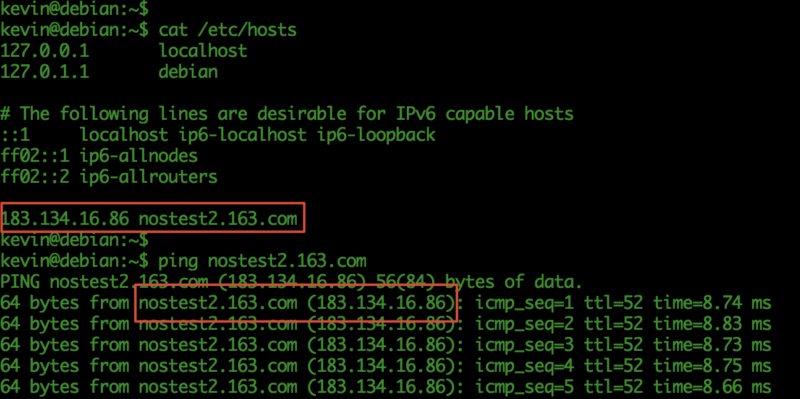

# 加速服务功能测试

## 前言

### 目的
加速服务部署完成后，我方内部已通过了功能验证，但是为了最大化地保障你的服务的可靠性，烦请你按照以下步骤进行测试。这个只是功能的测试，并不是真正的加速。

### 测试原理
通过设置本地机器的 host 文件，跳过 DNS 解析步骤，使本地机器通过加速节点访问加速域名，从而实现加速功能测试。

## 功能测试步骤

下面以加速域名 `nostest2.163.com` 为例，具体描述加速服务功能测试的步骤。

### 查看 CNAME 域名
在「网易蜂巢-CDN-加速域名详情」页面查看CNAME域名。如下图显示 `nostest2.163.com` 的 CNAME 域名为 `8b899bc8.nosdn.126.net`。

### 查找 CNAME 域名 IP
windows 系统打开 CMD 终端，linux 系统打开 shell 终端，通过 `ping ${CNAME域名}` 的方式，查找 CNAME 域名在本地环境下边缘节点的服务器 IP 地址。如下图显示边缘节点的服务器 IP 地址为「183.134.16.86」。

### 修改hosts文件
windows 系统打开 `C:\WINDOWS\system32\drivers\etc\hosts` 文件，linux 系统打开 `/etc/hosts` 文件，在 hosts 文件末尾新增域名与 IP 的映射关系（修改 hosts 文件可能需要管理员权限），具体内容为 `${边缘节点服务器ip} ${加速域名}`。修改 hosts 文件后通过 `ping ${加速域名}` 的方式验证 hosts 文件是否设置成功。如下图所示：

### 验证加速功能是否正常

重新打开浏览器，使 hosts 文件在浏览器中生效。在浏览器中访问加速域名和加速域名下的相关资源文件，验证加速功能是否正常。如访问 `http://nostest2.163.com`、`http://nostest2.163.com/test.jpg` 等加速域名下的资源。

Attention:
测试完成后记得删除 hosts 中刚添加的记录，避免影响您日后网站的访问。
