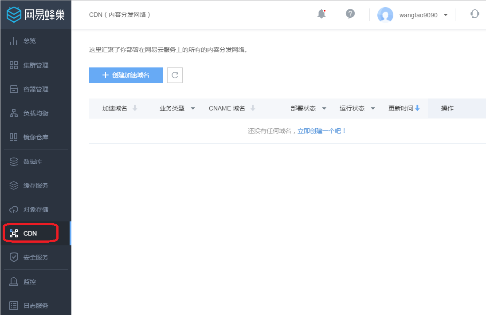

# 加速域名管理

## 创建加速域名

如上图所示，进入CDN控制台页面后，点击“创建加速域名”进入如下图所示界面。

### 填写加速域名
你输入的域名必须是备案完成的，正在备案的域名无法接入。

域名内容需符合CDN业务规范。

支持泛域名加速，不支持中文域名加速。

### 选择业务类型=
* **图片小文件加速**：若加速内容多为图片及网页文件，推荐使用图片小文件加速
* **大文件下载加速**：若加速内容为大文件（一般来说20M以上的静态文件属于大文件范畴），推荐使用大文件加速下载
* **流媒体加速**：若大文件为音视频文件，加速视频的点播业务，推荐使用流媒体加速方式

### 选择源站类型
* **IP地址**

可写多个服务器外网 IP

* **源站域名** 

输入源站域名

注意：源站地址不能与加速域名相同，例如您的加速域名为 test.yourdomain.com，建议将资源源站设置为 src.yourcompany.com
* **NOS域名**

可选择已经存在的NOS桶域名

信息填写完成后，点击“立即创建”提交创建信息。

## CNAME 配置

启用 CDN 加速服务，需要将您的域名指向加速域名，再由加速域名来提供 IP 地址， 需要在 DNS 服务商处为域名添加 CNAME 记录，从而达到内容分发加速的效果。

主机记录为加速域名

记录值为 CNAME 域名，见域名详情页，如下图所示：

## 设置加速域名

进入加速域名列表页，在需要设置的加速域名行点击「设置」，进入如下图所示页面，在页面中，您可以如下信息进行变更：

1.源站类型

2.源站信息

变更设置完成后点击「提交设置」完成设置。

## 禁用/启用加速域名
进入加速域名列表页，在需要设置的加速域名行点击「禁用」/「启用」，会弹出二次确认。

点击确后需要进行安全校验，校验完成后操作提价成功。

## 删除加速域名

进入加速域名列表页，在需要设置的加速域名行点击「删除」，进行安全校验后删除操作提交成功。
