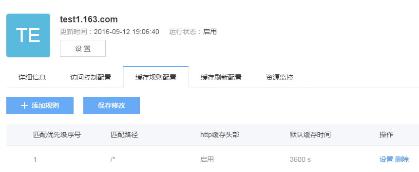
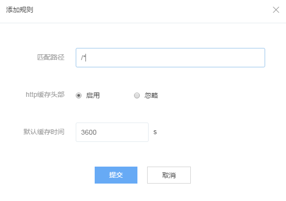

# 缓存规则配置
加速域名详情页，点击「缓存规则配置」，进入缓存规则列表。

当用户新建加速域名不使用自定义缓存规则时，系统启用以下默认规则：

|**标号**|                                **规则**                                            | 
|--------|------------------------------------------------------------------------------------|
| 1      | 对php、aspx、asp、jsp、do、dwr、cgi、fcgi、action、ashx、axd、json等动态文件不缓存 |  
| 2      | 对以shtml、html、htm、js结尾的文件，默认缓存半天(720分钟)                          |	  
| 3      |其他静态文件默认缓存一天(1440分钟)	                                              |         

支持**多条访问控制规则**，系统会逐条判断，只有符合全部访问规则的请求才允许访问。

Attention:在访问控制配置总，所有添加、设置、删除操作，在操作完成后均需点击「保存修改」后才会被提交。

## 添加规则

点击「添加规则」，进入下图所示界面：

您可以对如下信息进行配置：

 * 匹配路径
当用户设置缓存规则时，需要指定具体路径下（即`<path-pattren>`）资源的缓存时间， path-pattern支持模糊正则，可进行诸如”/(a|b/*.(jpg|bmp|png|gif))”等正则规则的设定。 模糊正则的含义如下：

|path-pattern	  |                         **含义**                         |
|-----------------|----------------------------------------------------------|
| /*.jpg          |所有的jpg文件，也包含/xx/等子目录下的所有jpg文件	         |
| gif)            |所有的jpg和gif文件，也包含/xx/等子目录下的所有jpg文件	 |        
| /a/*            |目录/a下的所有文件，也包含/a/xx/等子目录下的所有文件。	 |
| b)/*.jpg	      |b)/xx/x下所有jpg文件。	                                 |        

 * 是否缓存 http头部 
 设置启用时，源站设置的 HTTP Cache-Control 请求头生效。 设置忽略时，源站设置的 HTTP Cache-Control 请求头将被忽略，无论源站是否设置 Cache-Control，访问的资源都将被缓存。
 * 默认缓存时间
 缓存时间为指定缓存规则下的资源指定最大缓存时间，单位秒

## 调整规则优先级

可以通过鼠标拖拽上下移动的方式设置缓存规则优先级。

## 设置已有规则

在需要进行设置的规则项，点击「设置」可对规则进行变更设置。

## 删除规则

在需要进行设置的规则项，点击「删除」可删除已有访问控制规则。

  

