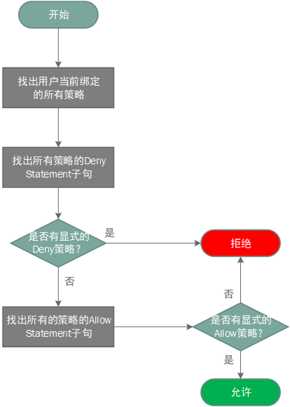

# 策略鉴权逻辑

当创建请求时，蜂巢决定是否应允许或拒绝该请求的鉴权逻辑遵循以下规则：

* 默认情况下，所有请求都将被拒绝；
* 显式允许将取代此默认设置；
* 显式拒绝将覆盖任何允许；
* 评估策略的顺序对于评估结果没有影响，将评估所有策略，而且结果始终是允许或拒绝请求。

以下流程图提供了详细的逻辑：

Note:
例如：一个群组的多条策略中既包含 allow 又包含 deny 时，我们遵循 deny 优先（只认 deny 不认 allow）原则。

