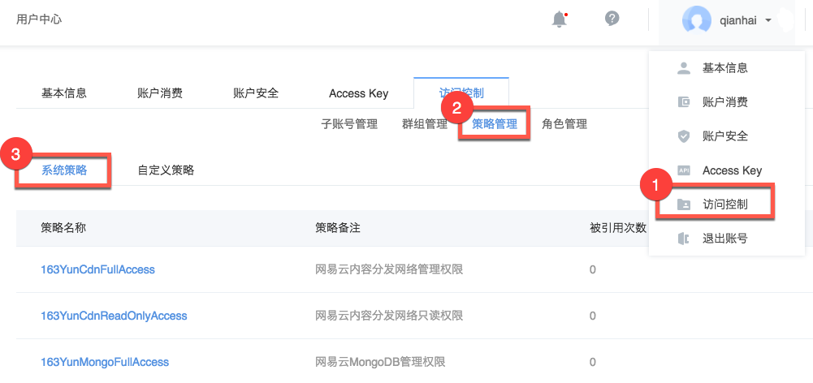

# 系统策略

策略是一组权限的集合，它以一种策略语言来描述。通过给群组添加策略，群组中的所有子账号就能获得授权策略中指定的访问权限。

## 系统策略

系统策略是蜂巢提供的一组通用授权策略，主要针对不同产品的只读权限或所有权限。对于蜂巢提供的系统策略，用户只能用于授权，而不能编辑和修改。

目前支持的系统策略：

|          策略名称         |          策略备注          |
|---------------------------|----------------------------|
| 163YunNosFullAccess       | 网易云对象存储管理权限     |
| 163YunNosReadOnlyAccess   | 网易云对象存储只读权限     |
| dunDefaultRolePolicy      | 易盾反垃圾角色策略         |
| mtsDefaultRolePolicy      | 视频转码角色策略           |
| 163YunNlbReadOnlyAccess   | 网易云负载均衡只读权限     |
| 163YunNlbFullAccess       | 网易云负载均衡管理权限     |
| 163YunNcrFullAccess       | 网易云缓存服务管理权限     |
| 163YunNcrReadOnlyAccess   | 网易云缓存服务只读权限     |
| 163YunCdnFullAccess       | 网易云内容分发网络管理权限 |
| 163YunCdnReadOnlyAccess   | 网易云内容分发网络只读权限 |
| 163YunMongoReadOnlyAccess | 网易云MongoDB只读权限      |
| 163YunMongoFullAccess     | 网易云MongoDB管理权限      |
| 163YunRdsFullAccess       | 网易云关系型数据库管理权限 |
| 163YunRdsReadOnlyAccess   | 网易云关系型数据库只读权限 |

## 查看系统策略

1. 鼠标移动到 [控制台](http://yq-ci.163.com/dashboard#/m/account/sam/policy/official/) 右上角用户头像处，在弹出的下拉菜单中选择「**访问控制**」；
2. 在访问控制页面，点击「**策略管理**」标签；
3. 在「**系统策略**」标签内即可查看到所有系统策略：

