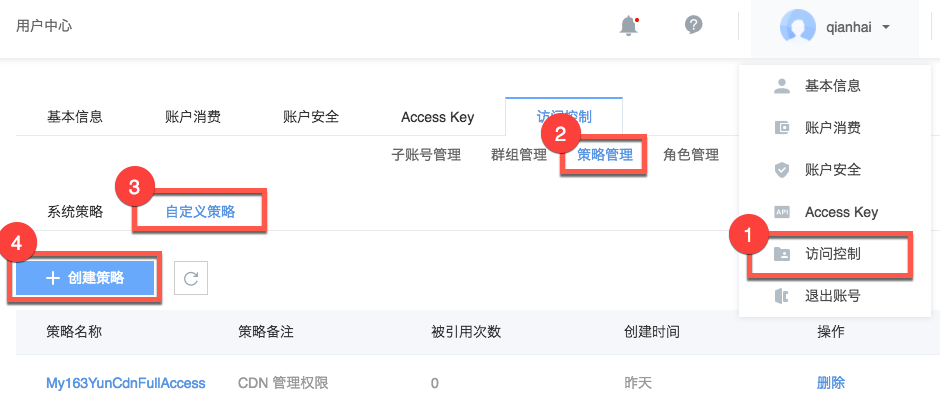
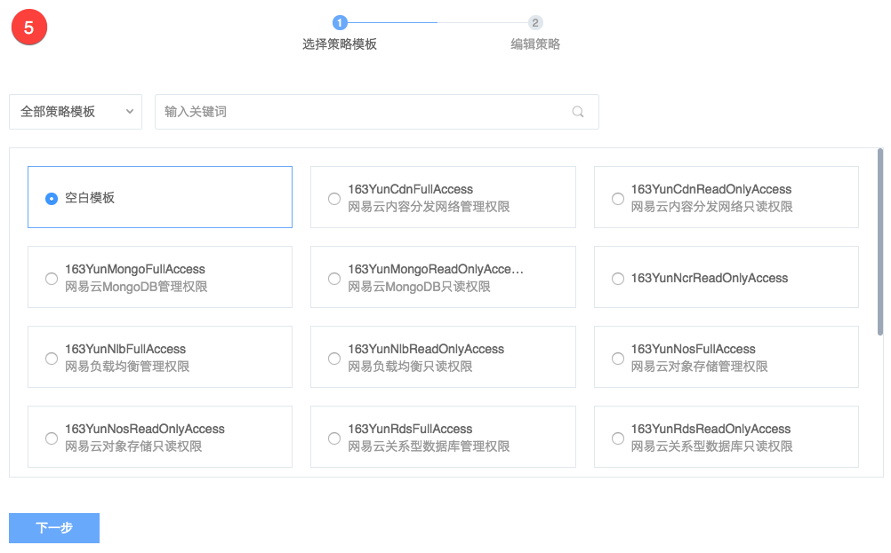
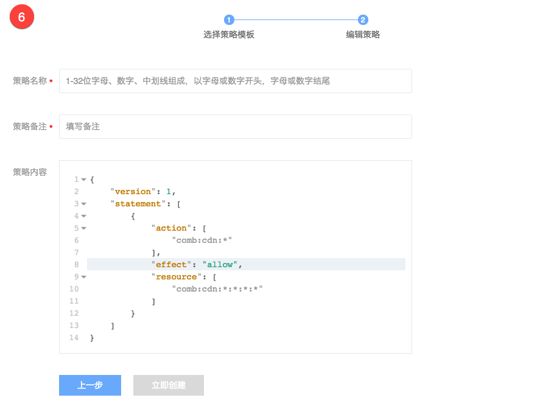
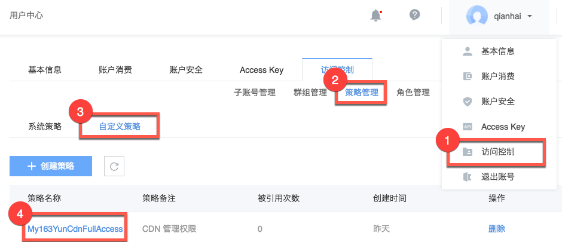
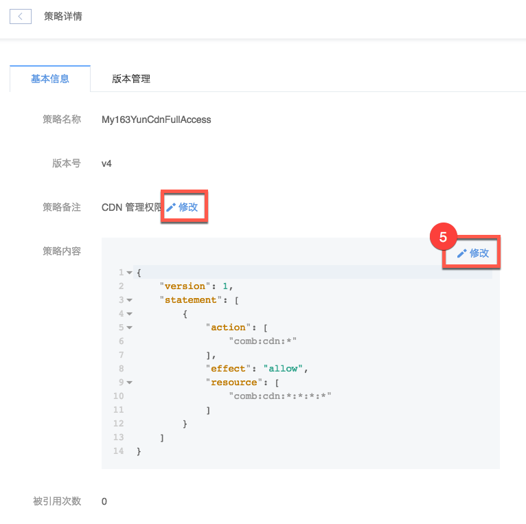
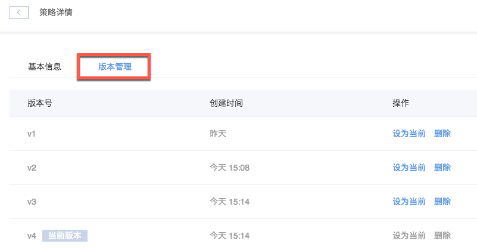
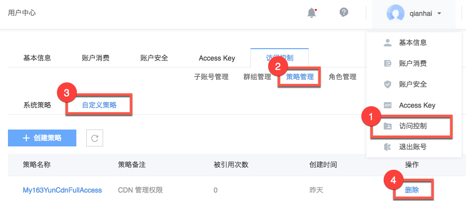

# 自定义策略

系统策略仅提供通用的粗粒度授权策略，若需要更细粒度的授权策略，网易蜂巢提供自定义策略。

**使用场景：**
* 控制具体某个 RDS 实例的操作权限；
* 控制具体某个对象存储桶内图片前缀的对象操作权限；

**目前支持的服务：**
* 对象存储 - 业务代码 nos
* 负载均衡 - 业务代码 nlb
* Redis - 业务代码 ncr
* CDN - 业务代码 cdn
* MongoDB - 业务代码 mongodb
* RDS - 业务代码 rds

Note:
该策略同时作用于控制台和 OpenAPI。

## 一、创建自定义策略
Note:
创建完成后策略名称不允许修改；
version 不支持自主修改，修改策略后 version 将自增；
策略语法目前支持：action、effect、resource。

1. 鼠标移动到 [控制台](http://c.163.com/dashboard#/m/account/sam/policy/official/) 右上角用户头像处，在弹出的下拉菜单中选择「**访问控制**」；
2. 在访问控制页面，点击「**策略管理**」标签；
3. 点击「**自定义策略**」标签；
4. 点击「**创建策略**」按钮：

5. 选择策略模板：

6. 编辑策略：

## 二、修改策略和版本管理
Note:
支持五个版本，达到上限后请删除部分版本。

1. 鼠标移动到 [控制台](http://c.163.com/dashboard#/m/account/sam/policy/official/) 右上角用户头像处，在弹出的下拉菜单中选择「**访问控制**」；
2. 在访问控制页面，点击「**策略管理**」标签；
3. 点击「**自定义策略**」标签；
4. 点击目标策略名称：

5. 按需修改策略备注或内容：

6. 点击版本管理标签，可以回滚策略版本，删除对应版本策略：

## 三、删除策略
Note:
策略删除后不可恢复，请谨慎操作；
包含多个版本的策略也支持直接删除；
已被引用的的策略，删除时也将提示目前引用的群组。

1. 鼠标移动到 [控制台](http://c.163.com/dashboard#/m/account/sam/policy/official/) 右上角用户头像处，在弹出的下拉菜单中选择「**访问控制**」；
2. 在访问控制页面，点击「**策略管理**」标签；
3. 点击「**自定义策略**」标签；
4. 定位到目标策略，点击右侧操作列的「**删除**」按钮：

