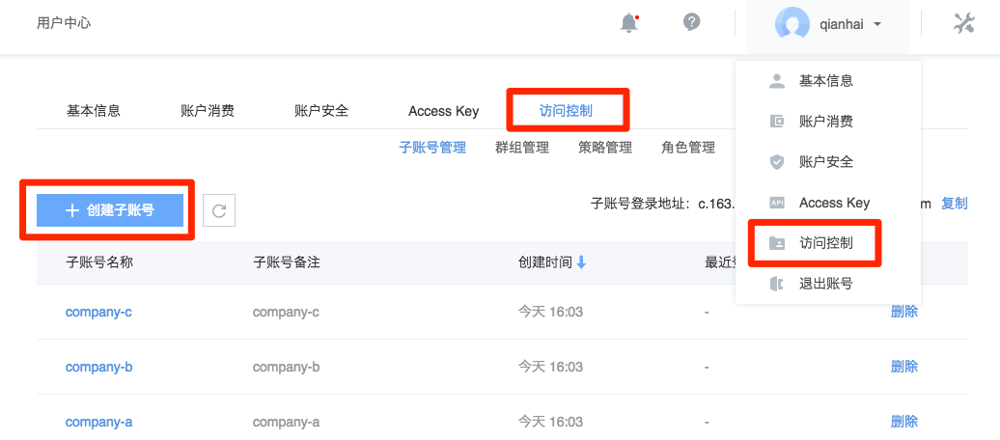

# 子账号

## 创建子账号

将鼠标移动到控制台右上角用户头像处，在弹出的下拉菜单中选择「访问控制」，然后点击「创建子账号」。

Note:
出于安全考虑，每次创建子账号均需要进行安全手机验证。

创建时，填写项：

* 子账号名称（不支持修改）
* 登录密码
* 子账号备注
* 安全手机
* 邮箱

## 管理子账号

支持在子账号管理页面删除子账号、查看最近登录时间。点击对应子账号名称后，进入子账号详情页，支持：

* 基本信息：重置登录密码、修改子账号备注、修改邮箱、修改安全手机
* Access Key：管理子账号 Access Key（创建、下载、禁用、删除）
* 授权管理：加入/离开群组

## 登录子账号

子账号默认没有任何访问权限，需加入拥有对应策略的群组。

在「用户中心」-「访问控制」-「子账号管理」处可以看到子账号登录地址，命名规则：`c.163.com/account/{主账号}`

