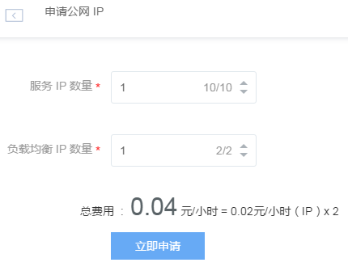

# 申请公网 IP

1. 登录 [控制台](https://c.163.com/dashboard#/m/net/)，定位「**IP 管理**」标签；
2. 在 IP 管理列表左上角，点击「**申请公网 IP**」按钮：

Note:
也可以在创建有状态服务/云主机/负载均衡时申请新 IP（随机分配）；
通用 IP用于绑定服务、云主机，负载均衡 IP 用于绑定负载均衡实例；
申请成功即开始计费，无论是否绑定服务/云主机/负载均衡；
如需增加配额请提交工单联系我们。
