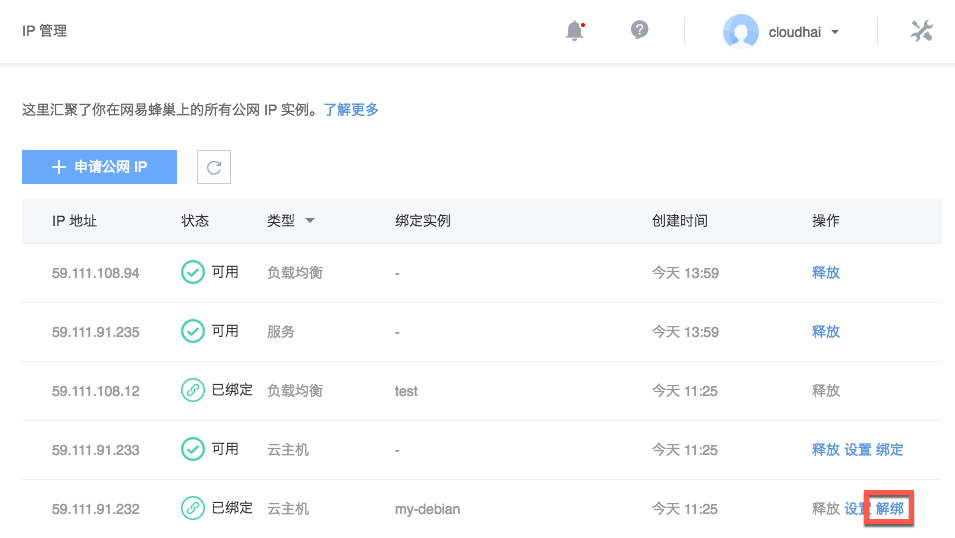

# 解绑公网 IP

Note:
服务/负载均衡删除实例后即解绑，不支持在IP 管理解绑；
云主机删除实例后即解绑，也支持在IP 管理解绑；
解绑后 IP 即与对应实例解除绑定，但不会释放该公网 IP，只有释放后才会停止计费。

## 操作步骤

1. 登录 [控制台](https://c.163.com/dashboard#/m/net/)，定位「**IP 管理**」标签；
2. 在 IP 管理列表，定位到需要解绑的 IP：
3. 在右侧操作栏，点击「**解绑**」按钮即可：

Note:
云主机端操作详见：[云主机解绑公网 IP](http://support.c.163.com/md.html#!容器服务/云主机/使用指南/linux主机解绑公网IP.md) 。

