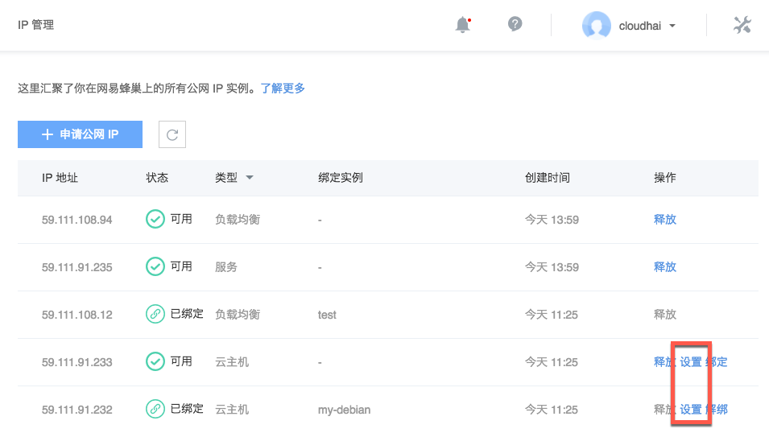
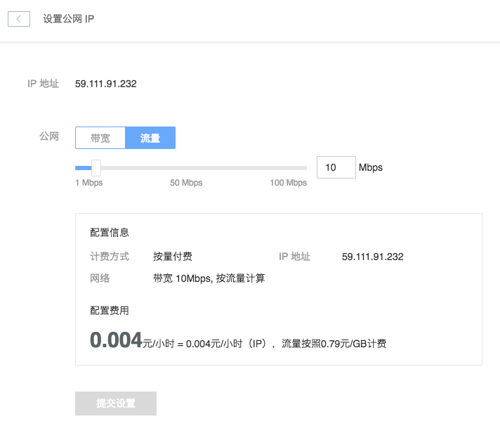

# 设置公网 IP

Note:
目前支持在 IP 管理调整云主机的公网设置

## 操作步骤

1. 登录 [控制台](https://c.163.com/dashboard#/m/net/)，定位「**IP 管理**」标签；
2. 在 IP 管理列表，定位到需要设置的云主机 IP；
3. 在右侧操作栏，点击「**设置**」按钮：

4. 在弹出的设置公网 IP 页面，调整相关设置：

Note:
支持设置在按流量计费时的带宽上限自定义；
未绑定云主机的公网 IP 若选择按带宽计费，将增加带宽费用。