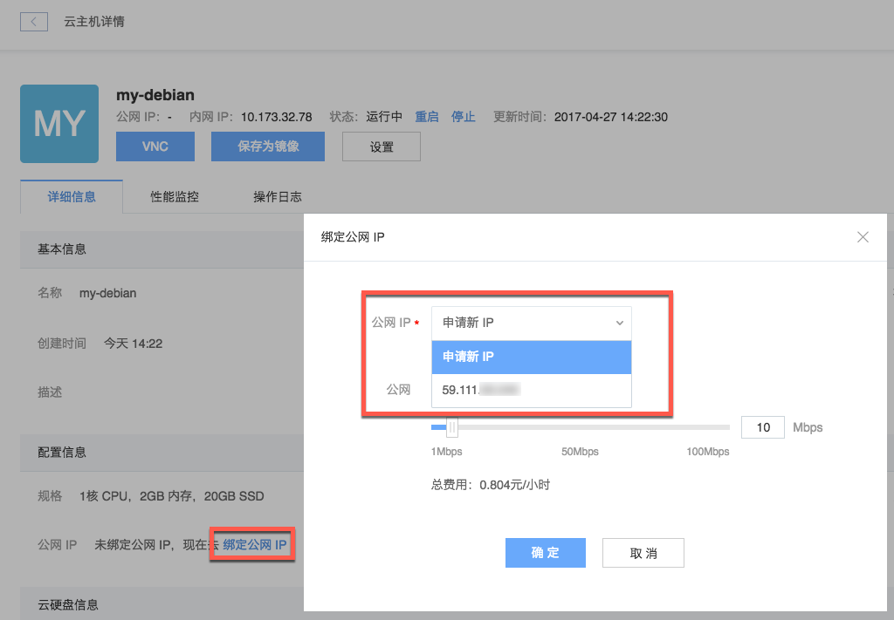

# 绑定云主机

## 云主机创建完成后绑定

1. 登录 [控制台](https://c.163.com/dashboard#/m/ingress/)，定位到「云主机」标签；

2. 定位到目标实例，点击实例名称，进入云主机详情页；

3. 在「配置信息」内绑定公网 IP：

详见：[云主机绑定公网 IP](http://support.c.163.com/md.html#!容器服务/云主机/使用指南/linux主机绑定公网IP.md) 。

