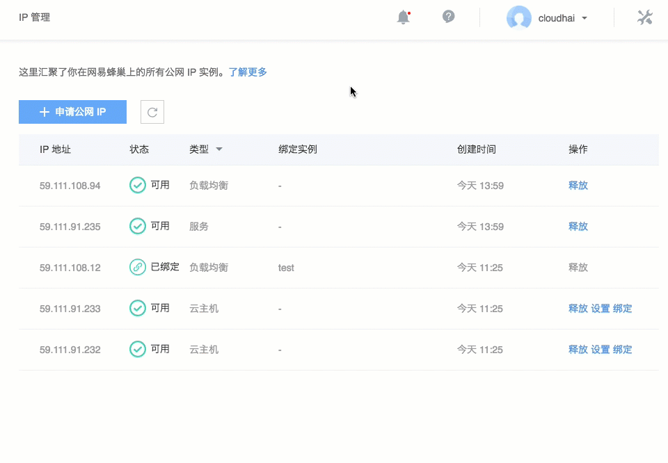

# 绑定云主机

1. 登录 [控制台](https://c.163.com/dashboard#/m/net/)，定位「**IP 管理**」标签；
2. 在 IP 管理列表，定位到需要班定云主机的 IP：
3. 在右侧操作栏，点击「**绑定**」按钮；
4. 在弹出的菜单中，选择需要绑定的云主机名称即可：

Note:
云主机端操作详见：[云主机绑定公网 IP](http://support.c.163.com/md.html#!容器服务/云主机/使用指南/linux主机绑定公网IP.md) 。

