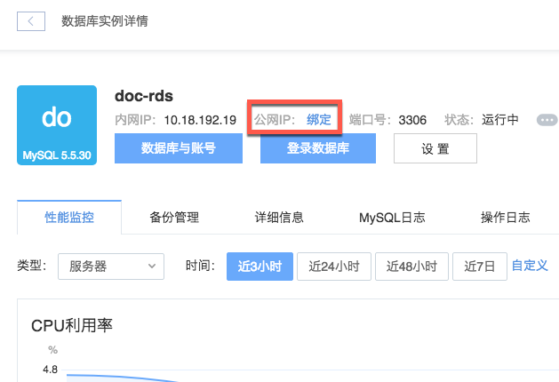

# 绑定关系型数据库

Note:
出于安全考虑不建议开启公网，可以通过 [蜂巢 OpenVPN](../md.html#!计算服务/容器服务/使用技巧/如何使用蜂巢 OpenVPN.md)，使用内网 IP 连接。

## 关系型数据库创建完成后绑定

1. 登录 [控制台](https://c.163.com/dashboard#/m/rds/)，点击「关系型数据库」标签；

2. 定位到目标实例，点击实例名称，进入数据库实例详情页；

3. 在「**公网 IP**」处绑定公网 IP：

