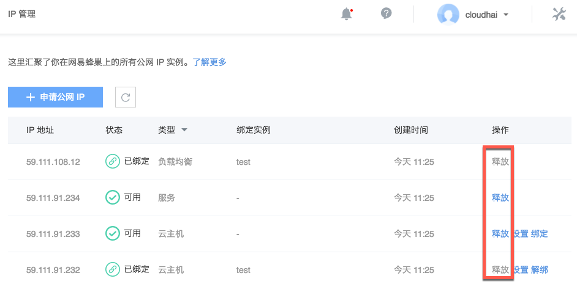

# 释放公网 IP

Attention:
释放的 IP 无法找回；
已绑定服务、负载均衡的 IP 须先删除对应实例；
已绑定云主机的 IP 须先解绑后再释放；
已绑定公网 IP 的服务或负载均衡，在删除时也支持勾选同时释放该 IP。

## 操作步骤

1. 登录 [控制台](https://c.163.com/dashboard#/m/net/)，定位「**IP 管理**」标签；
2. 在 IP 管理列表，定位到需要释放的 IP；
3. 在右侧操作栏，点击「**释放**」按钮即可：

