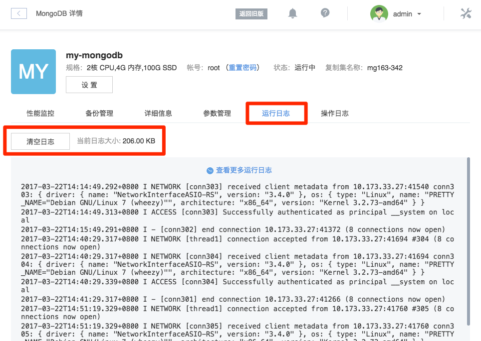
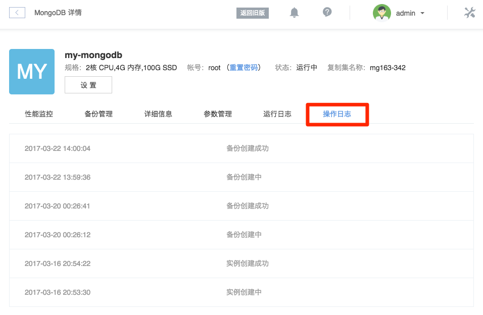

# 日志管理

蜂巢提供 MongoDB 实例的运行日志和操作日志。

## 运行日志

即 mongod 打印的 Primary 节点系统日志

➡ 登录 [控制台](https://c.163.com/dashboard#/m/mongodb/)，定位到目标实例
➡ 点击实例名称，进入「MongoDB」详情页
➡ 点击「运行日志」标签，即可查看运行日志

Note:
支持查看运行日志大小、清理日志文件

## 操作日志

操作日志记录了该实例的所有生命周期管理。

➡ 登录 [控制台](https://c.163.com/dashboard#/m/mongodb/)，定位到目标实例
➡ 点击实例名称，进入「MongoDB」详情页
➡ 点击「操作日志」标签，即可查看操作日志

