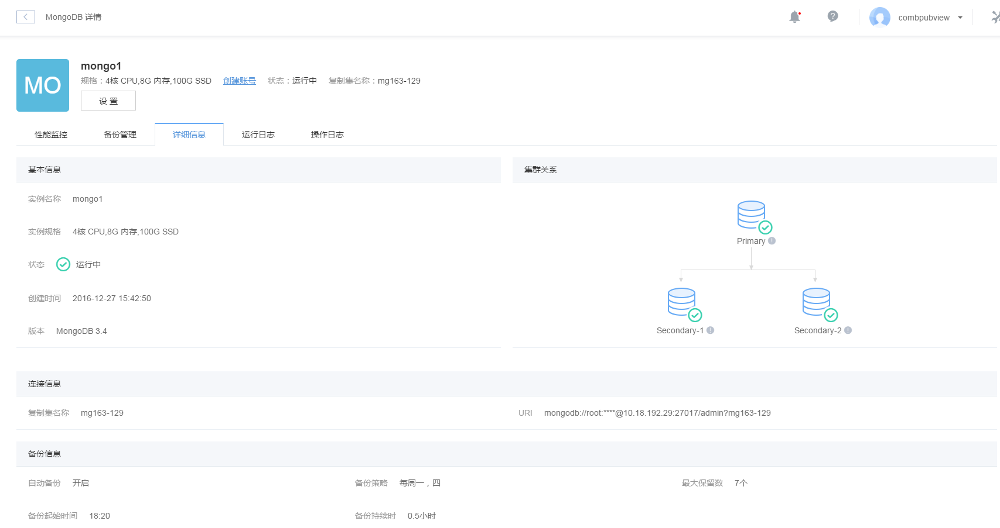
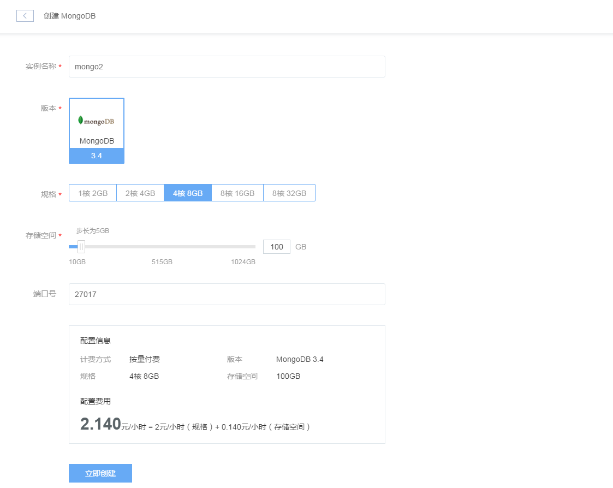

# 创建 MongoDB 实例
MongoDB 服务管理入口位于蜂巢首页的 MongoDB 选项，点击「MongoDB」，即可显示你的所有 MongoDB 实例列表。你可以在该界面进行实例的创建、修改实例设置等操作。

点击「实例名称」，即可进入实例详情界面，如下图所示：

## 创建实例
在 MongoDB 主界面，点击「创建实例」创建一个新的 MognoDB 实例，创建实例的界面如下图所示。首先需要填写实例名称、选择 MongoDB 版本、规格、存储空间，填写端口号，默认端口为 27017，然后点击「立即创建」按钮，开始实例的创建。

## 设置 (修改) 实例
某一指定实例的设置页面有两处入口:
1.在 MongoDB 的主页面，点击实例在「操作」列的「设置」链接，如下图所示:

2.在数据库的主界面，点击该实例的名称，进入实例的详情页面，再点击「设置」按钮，如下图所示:

设置页面提供了修改实例名称和备份设置的功能，不需要进行定期的备份时可以选择关闭备份。可以按照提示选择备份周期、备份起始时间、最大保留数、备份持续时间。最大保留数默认为 7 份，最大可设置为 10 份。配置完成之后点击「提交设置」，如下图所示:

