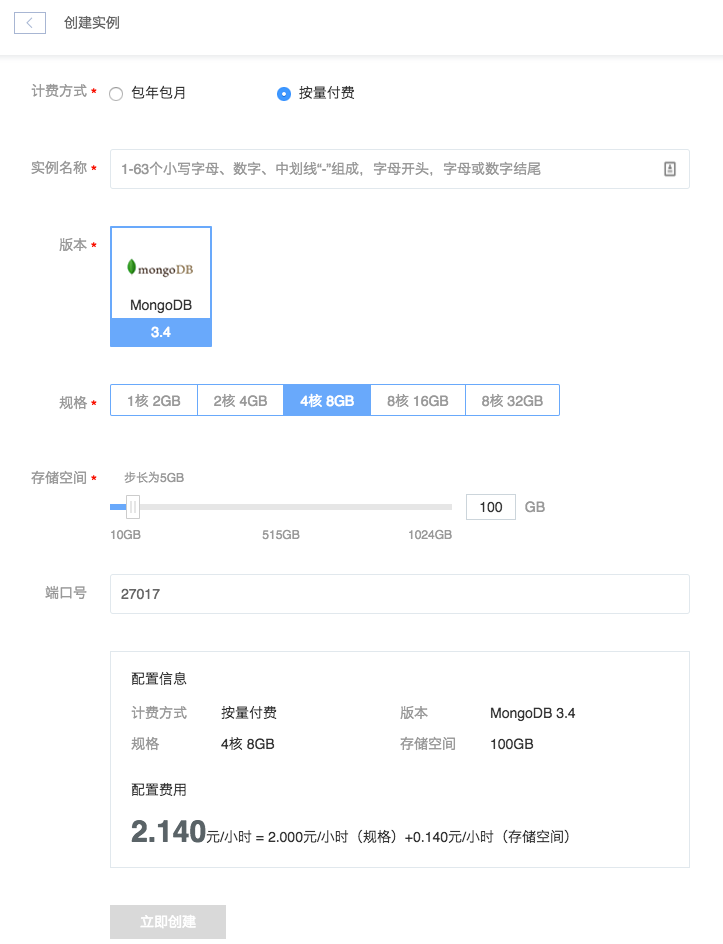

# 创建实例

MongoDB 有两种计费方式：包年包月和按量付费。建议你使用 [价格计算器](https://c.163.com/price) 对实例的价格成本进行初步估算。具体计费标准请参见 [MongoDB 价格与计费](http://http://support.c.163.com/md.html#!平台服务/MongoDB/购买指南/MongoDB价格与计费.md)。

## 创建流程

➡ 登录 [控制台](https://c.163.com/dashboard#/m/mongodb/)，定位 MongoDB 标签
➡ 点击 MongoDB 列表，左上角的「创建实例」按钮

