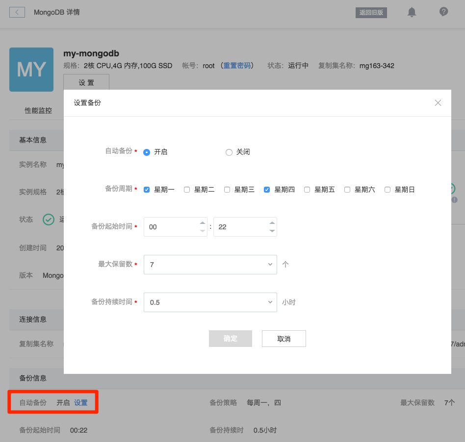

# 备份数据

Note:
默认已开启每周一、四自动备份。

## 1. 设置自动备份

➡ 登录 [控制台](https://c.163.com/dashboard#/m/mongodb/)，定位到目标实例
➡ 点击实例名称，进入「MongoDB」详情页
➡ 在「详细信息」标签下，找到「备份信息」
➡ 在自定备份右侧点击「设置」

Note:
备份最大保留数 10 个；
备份持续时间是指：若备份失败，我们将在该持续时间内一直重试，直到成功。

## 2. 手动备份

➡ 登录 [控制台](https://c.163.com/dashboard#/m/mongodb/)，定位到目标实例
➡ 点击实例名称，进入「MongoDB」详情页
➡ 点击「备份管理」标签
➡ 点击「手动创建备份」

